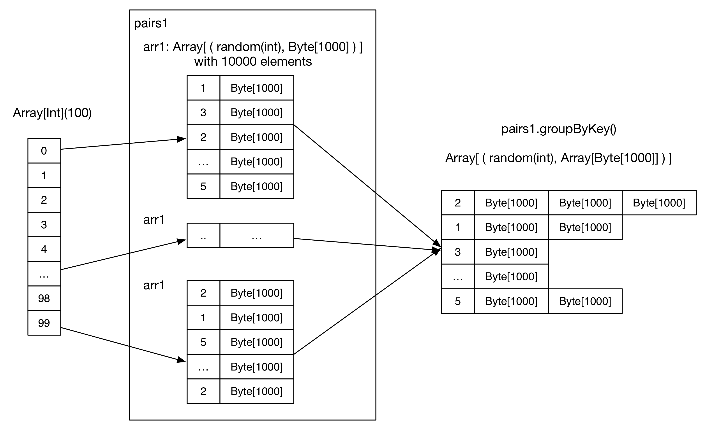

## Overview

This chapter aims to answer the following questions:

**Q1: After a successful deployment, what are the running services in each node?**

**Q2: How is the Spark application created and executed?**

## Deployment Diagram


We can see from the deployment diagram (Standalone version):
  - A Spark cluster has a Master node and multiple Worker nodes, which are equivalent to Hadoop's Master and Slave nodes.
  - The Master node has a Master daemon process, which manages all the Worker nodes.
  - The Worker node has a Worker daemon process, responsible for communicating with the Master node and managing local Executors.
  - In the official document, the Driver is explained as "The process running the main() function of the application and creating the SparkContext". A driver program, such as WordCount.scala, is regarded as a Spark application. If the driver program is launched on the Master node as follows:

    ```scala
	./bin/run-example SparkPi 10
	```
	The SparkPi program will become the Driver (on the Master node). However, if the driver program is submitted to a YARN cluster, the Driver may be scheduled to a Worker node (e.g., Worker node 2 in the diagram). If the driver program is launched on a local PC, such as running the following program in IntelliJ IDEA:

	```scala
	val sc = new SparkContext("spark://master:7077", "AppName")
	...
	```
   The driver program will run atop the local PC. However, this approach is not recommended since the local PC may not be in the same network with the Worker nodes, which will slow down the communication between the driver and the executors.

  - Each Worker manages one or multiple ExecutorBackend processes. Each ExecutorBackend launches and manages an Executor instance. Each Executor maintains a thread pool, in which each task runs as a thread.
  - Each application has one Driver and multiple Executors. The tasks within the same Executor belong to the same application.
  - In Standalone deployment mode, ExecutorBackend is instantiated as CoarseGrainedExecutorBackend.

    > In my cluster there's only one CoarseGrainedExecutorBackend process on each worker node and I didn't manage to configure multiple CoarseGrainedExecutorBackend processes on each worker node (my guess is that there'll be multiple CoarseGrainedExecutorBackend process when multiple applications are running, which needs to be confirmed).

    > Check out this blog (in Chinese) [Summary on Spark Executor Driver Resource Scheduling](http://blog.csdn.net/oopsoom/article/details/38763985) by [@OopsOutOfMemory](http://weibo.com/oopsoom), if you want to know more about the relationship between Worker and Executor.

  - Worker manages each CoarseGrainedExecutorBackend process thourgh an ExecutorRunner instance (Object).

After studying the deployment diagram, we'll write a simple Spark application to see how the Spark application is created and executed.

## A simple Spark application
The example here is the `GroupByTest` application under the examples package in Spark. We assume that the application is launched on the Master node, with the following command:

```scala
/* Usage: GroupByTest [numMappers] [numKVPairs] [valSize] [numReducers] */

bin/run-example GroupByTest 100 10000 1000 36
```

The code of this application is as follows:

```scala
package org.apache.spark.examples

import java.util.Random

import org.apache.spark.{SparkConf, SparkContext}

/**
 * Usage: GroupByTest [numMappers] [numKVPairs] [KeySize] [numReducers]
 */
object GroupByTest {
  def main(args: Array[String]) {
    val sparkConf = new SparkConf().setAppName("GroupBy Test")
    var numMappers = if (args.length > 0) args(0).toInt else 2
    var numKVPairs = if (args.length > 1) args(1).toInt else 1000
    var valSize = if (args.length > 2) args(2).toInt else 1000
    var numReducers = if (args.length > 3) args(3).toInt else numMappers

    val sc = new SparkContext(sparkConf)

    val pairs1 = sc.parallelize(0 until numMappers, numMappers).flatMap { p =>
      val ranGen = new Random
      var arr1 = new Array[(Int, Array[Byte])](numKVPairs)
      for (i <- 0 until numKVPairs) {
        val byteArr = new Array[Byte](valSize)
        ranGen.nextBytes(byteArr)
        arr1(i) = (ranGen.nextInt(Int.MaxValue), byteArr)
      }
      arr1
    }.cache()
    // Enforce that everything has been calculated and in cache
    pairs1.count()

    println(pairs1.groupByKey(numReducers).count())

    sc.stop()
  }
}

```

The code runs like the following figure in our brains:


Since this is a simple application, let's estimate the runtime data size in each step:

  1. Initialize SparkConf.
  2. Initialize `numMappers=100`, `numKVPairs=10,000`, `valSize=1000`, `numReducers= 36`.
  3. Initialize SparkContext, which creates the necessary objects and actors for the driver.
  4. Each mapper creates an `arr1: Array[(Int, Byte[])]`, which has `numKVPairs` elements. Each  `Int` is a random integer, and each byte array's size is `valSize`. We can estimate `Size(arr1) = numKVPairs * (4 + valSize) = 10MB`, so that `Size(pairs1) = numMappers * Size(arr1) ＝1000MB`.
  5. Each mapper is instructed to cache its `arr1` array into the memory.
  6. The action count() is applied to sum the number of elements in  `arr1` in all mappers, the result is `numMappers * numKVPairs = 1,000,000`. This action triggers the caching of `arr1`s.
  7. `groupByKey` operation is performed on cached `pairs1`. The reducer number (a.k.a., partition number) is `numReducers`. Theoretically, if hash(key) is evenly distributed, each reducer will receive `numMappers * numKVPairs / numReducer ＝ 27,777` pairs of `(Int, Array[Byte])`, with a size of `Size(pairs1) / numReducer = 27MB`.
  8. Reducer aggregates the records with the same Int key, the result is `(Int, List(Byte[], Byte[], ..., Byte[]))`.
  9. Finally, a `count()` action sums up the record number in each reducer, the final result is actually the number of distinct integers in `pairs1`.

## Logical Plan

The actual execution procedure is more complicated than what we described above. Generally speaking, Spark firstly creates a logical plan (namely data dependency graph) for each application, then it transforms the logical plan into a physical plan (a DAG graph of map/reduce stages and map/reduce tasks). After that, concrete map/reduce tasks will be launched to process the input data. Let's detail the logical plan of this application:

The function call of `RDD.toDebugString` can return the logical plan:

```scala
  MapPartitionsRDD[3] at groupByKey at GroupByTest.scala:51 (36 partitions)
    ShuffledRDD[2] at groupByKey at GroupByTest.scala:51 (36 partitions)
      FlatMappedRDD[1] at flatMap at GroupByTest.scala:38 (100 partitions)
        ParallelCollectionRDD[0] at parallelize at GroupByTest.scala:38 (100 partitions)
```

We can draw a diagram to illustrate logical plan:


> Note that the **data in the partition** block only shows what data will be generated in this partition, but this does not mean that these data all reside in memory at the same time.

Let's detail the logical plan:
  - The user first initializes an array, which contains 100 integers (i.e., 0 to 99).
  - parallelize() generates the first RDD (ParallelCollectionRDD), in which each partititon contains an integer i.
  - FlatMappedRDD is generated by calling a transformation method (flatMap) on the ParallelCollectionRDD. Each partition of the FlatMappedRDD contains an `Array[(Int, Array[Byte])]`.
  - The first count() performs on FlatMappedRDD.
  - Since the FlatMappedRDD is cached in memory, its partitions are colored differently.
  - groupByKey() generates the following 2 RDDs (ShuffledRDD and MapPartitionsRDD), and we will see the reason in later chapters.
  - ShuffleRDD in the logical plan means that the job needs a shuffle. This shuffle is similar with the shuffle in Hadoop MapReduce.
  - MapPartitionRDD contains groupByKey()'s computing results.
  - Each value in MapPartitionRDD (`Array[Byte]`) is converted to `Iterable`.
  - The last count() action performs on MapPartitionRDD.

**The logical plan represents the application dataflow, including the data transformations , the intermediate RDDs, and the data dependency between these RDDs.**

## Physical Plan

The logical plan aims to model the dataflow, not the execution flow. The dataflow and execution flow are unified in Hadoop. In Hadoop, the dataflow is pre-defined and fixed, users just need to write map() and reduce() functions. The map/reduce tasks have fixed processing steps. However in Spark, the dataflow is very flexible and could be very complicated, so it's difficult to simply combine the dataflow and execution flow together. For this reason, Spark separates the dataflow from the actual task execution, and has algorithms to transform a logical plan into a physical plan. We'll discuss this transformation in later chapters.

For the example application, let's draw its physical DAG:


We can see that the GroupByTest application generates 2 Spark jobs, the first job is triggered by the first action (i.e., `pairs1.count()`). Let's detail this first job:

  - This job contains only 1 stage, which has 100 ResultTasks. Here, the stage is similar with the map stage in Hadoop but not shown in this figure. The stage concept will be detailed in later chapters.
  - Each task performs flatMap, generates FlatMappedRDD, and then executes the action `count()` to count the record number in each partition. For example, partition 99 has  9 records, so the `result 99` is 9.
  - Since `pairs1` is specified to be cached, the tasks will cache the partitions of FlatMappedRDD inside the executor's memory space at runtime.
  - After the ResultTasks finish, the driver collects the tasks' results and sums them up.
  - Job 0 completes.

The second job is triggered by `pairs1.groupByKey(numReducers).count`:

  - This job has 2 stages.
  - Stage 0 contains 100 ShuffleMapTask, each task reads a partition of `paris1` from the cache, repartitions it, and then write the repartitioned results into local disk. This step is similar to partitioning map outputs in Hadoop.
  - Stage 1 contains 36 ResultTasks. Each task fetches and shuffles the data that it needs to process. It fetches the data, aggregates the data, and performes mapPartitions() operation in a pipeline style. Finally, count() is applied to get the result.
  - After the ResultTasks finish, the driver collects the tasks' results and sums them up.
  - Job 1 completes.

We can see that the physical plan is not simple. A Spark application can contain multiple jobs, each job could have multiple stages, and each stage has multiple tasks. **In later chapters, we'll detail how the jobs, stages and tasks are generated**

## Conclusion
Now, we have a basic knowledge of Spark job's creation and execution. We also discussed the cache feature of Spark.
In the following chapters, we'll discuss the key steps in job's creation and execution, including:
  1. Logical plan generation
  2. Physical plan generation
  3. Job submission and scheduling
  4. Task's creation, execution and result handling
  5. How shuffle is done in Spark
  6. Cache mechanism
  7. Broadcast mechanism
