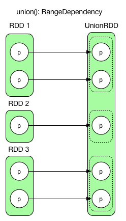
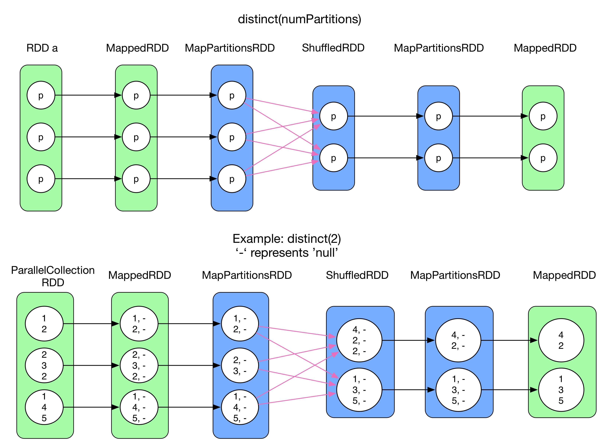
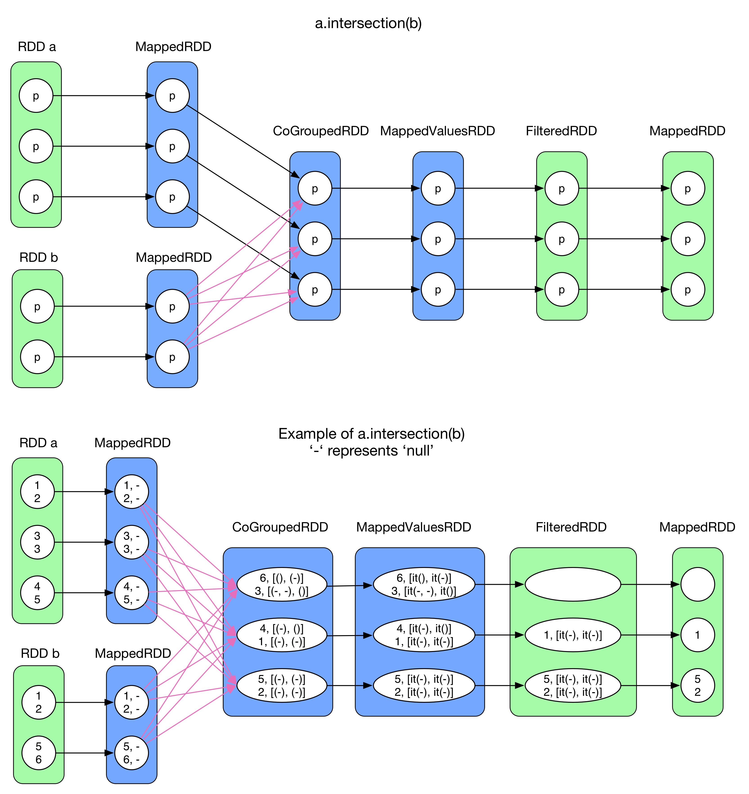
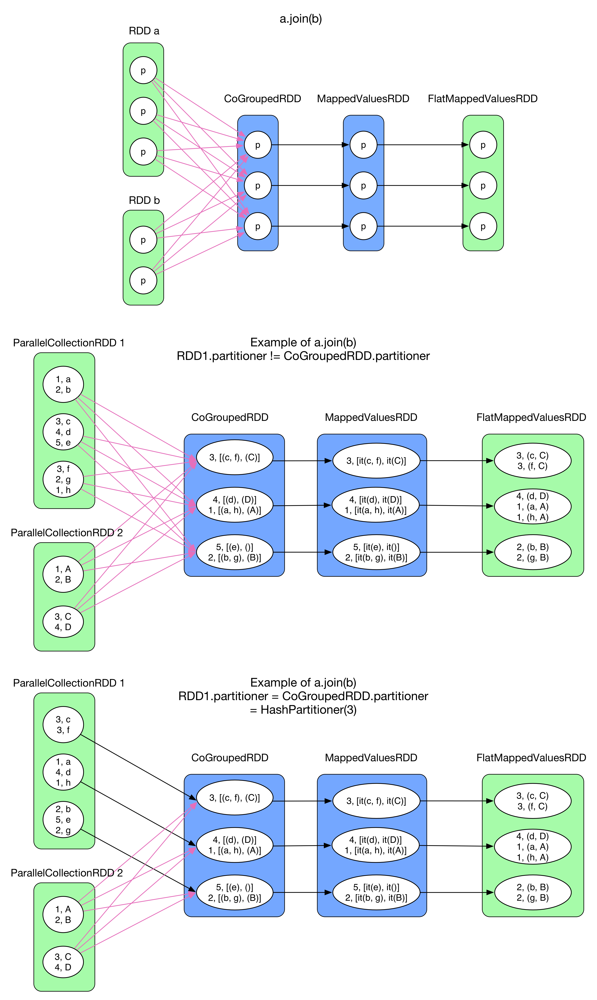
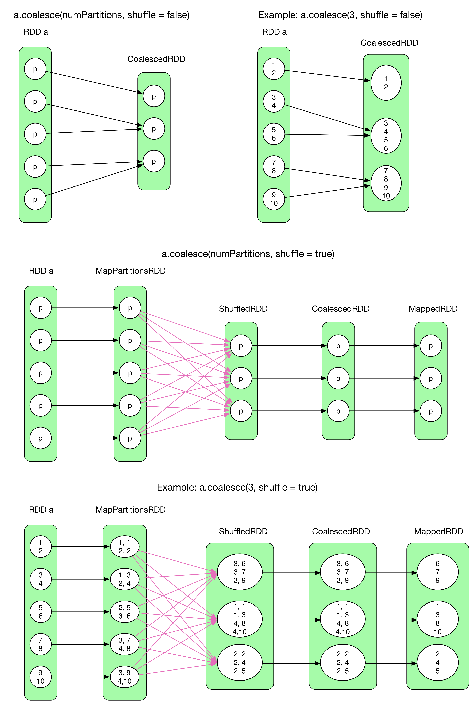

# Job Logical Plan

## An example of general logical plan


The above figure illustrates a general job logical plan, which takes 4 steps to get the final result:

1.	Create the initial `RDD` from any source (e.g., in-memory data structures, local file, HDFS, and HBase). Note that `createRDD()` is equivalent to `parallelize()` mentioned in the previous chapter.

2.	A series of *transformation operations* on `RDD`, denoted as `transformation()`. Each `transformation()` produces one or multiple serial `RDD[T]`s, where `T` can be any type in Scala.

	>	If T is (K, V), K cannot be set to be collection type, such as `Array` and `List`, since it is hard to define `partition()` function on collections.

3.	*Action operation*, denoted as `action()` is called on the final `RDD`. Then, each partition generates computing result.

4.	These results will be sent to the driver, then `f(List[Result])` will be performed to compute the final result. For example, `count()` takes two steps, `action()` and `sum()`.

> RDD can be cached in memory or persited on disk, by calling `cache()`, `persist()` or `checkpoint()`. The number of partitions is usually set by user. Partition mapping between two RDDs can be 1:1 or M:N. In the picture above, we can see not only 1:1 mapping, but also M:N mapping.

## Logical Plan

While writing Spark code, you might also have a logical plan (e.g.,  how many RDDs will be generated) in you mind (like the one above). However, in general, more RDDs will be generated at runtime.

In order to make this logical plan clear, we will answer the following questions from the view of Spark itself: Given a Spark program,

-	How to produce RDDs? What kinds of RDDs should be produced?
-	How to connect (i.e., build data dependency between) RDDs?

###	1. How to produce RDDs? What RDD should be produced?

A `transformation()` usually produces a new RDD, but some `transformation()`s can produce multiple RDDs because they have multiple processing steps or contain several sub-`transformation()`. That's why the number of RDDs is, in fact, more than we thought.

Logical plan is essentially a *computing chain*. Every RDD has a `compute()` method, which reads input records (e.g., key/value pairs) from the previous RDD or data source, performs `transformation()`, and then outputs new records.

What RDDs should be produced depends on the computing logic of the `transformation()`. Let's talk about some typical [transformation()](http://spark.apache.org/docs/latest/programming-guide.html#transformations) and their produced RDDs.

We can learn about the meaning of each `transformation()` on Spark site. More details are listed in the following table, where `iterator(split)` denotes *for each record in a partition*. There are some blanks in the table, because they are complex `transformation()` that produce multiple RDDs. They will be detailed soon after.

| Transformation |  Generated RDDs | Compute() |
|:-----|:-------|:---------|
| **map**(func) | MappedRDD | iterator(split).map(f) |
| **filter**(func) | FilteredRDD | iterator(split).filter(f) |
| **flatMap**(func) | FlatMappedRDD | iterator(split).flatMap(f) |
| **mapPartitions**(func) | MapPartitionsRDD | f(iterator(split)) | |
| **mapPartitionsWithIndex**(func) | MapPartitionsRDD |  f(split.index, iterator(split)) | |
| **sample**(withReplacement, fraction, seed) | PartitionwiseSampledRDD | PoissonSampler.sample(iterator(split))  BernoulliSampler.sample(iterator(split)) |
| **pipe**(command, [envVars]) | PipedRDD | |
| **union**(otherDataset) |  |  |
| **intersection**(otherDataset) | | |
| **distinct**([numTasks])) | | |
| **groupByKey**([numTasks]) | | |
| **reduceByKey**(func, [numTasks]) | | |
| **sortByKey**([ascending], [numTasks]) | | |
| **join**(otherDataset, [numTasks]) | | |
| **cogroup**(otherDataset, [numTasks]) | | |
| **cartesian**(otherDataset) | | |
| **coalesce**(numPartitions) | | |
| **repartition**(numPartitions) | | |

###	2. How to build data dependency between RDDs?

This question can be divided into three smaller questions:
-	A RDD (e.g., `RDD x`) depends on one parent RDD or several parent RDDs?
-	How many partitions are there in `RDD x`?
-	What's the relationship between the partitions of `RDD x` and those of its parent RDD(s)? One partition depends one or several partitions of the parent RDD?

The first question is trivial. `x = rdda.transformation(rddb)` means that RDD `x` depends on `rdda` and `rddb`. For example, `val x = a.join(b)` means that `RDD x` depends both `RDD a` and `RDD b`.

For the second question, as mentioned before, the number of partitions is defined by user, by default, it takes `max(partitionNum of parentRDD1, ..., partitionNum of parentRDDn)`.

The third question is a bit complex, we need to consider the semantics of `transformation()`. Different `transformation()`s have different data dependencies. For example, `map()` is 1:1. `groupByKey()` produces a `ShuffledRDD`, in which each partition depends on all partitions in its parent RDD. Some other `transformation()`s can be more complex.

In Spark, there are two  kinds of data partition dependencies between RDDs:
-	NarrowDependency (e.g., OneToOneDependency and RangeDependency)

	>	Each partition of the child RDD **fully** depends on a small number of partitions of its parent RDD. **Fully depends** (i.e., **FullDependency**) means that a child partition depends the **entire** parent partition.
-	ShuffleDependency (or Wide dependency mentioned in Matei's paper)

	>	Multiple child partitions **partially** depends on a parent partition. **Partially depends** (i.e., **PartialDependency**) means that each child partition depends **a part of** the parent partition.

For example, `map()` leads to a narrow dependency, while `join()` usually leads to to a wide
dependencies.

Moreover, a child partition can depend on one partition in a parent RDD and one partition in another parent RDD.

Note that:
-	For `NarrowDependency`, whether a child partition depends one or multiple parent partitions is determined by the `getParents(partition i)` function in child RDD. (More details later)
-	ShuffleDependency is like shuffle dependency  in MapReduce（the mapper partitions its outputs, then each reducer will fetch all the needed output partitions via http.fetch)

The two dependencies are illustrated in the following figure.


According to the definition, the first three cases are `NarrowDependency` and the last one is `ShuffleDependency`.

Need to mention that the left one on the second row is a rare case. It is a N:N `NarrowDependency`. Although it looks like ShuffleDependency, it is a full dependency. It can be created in some tricky `transformation()`s. We will not talk about this case, because `NarrowDependency` essentially means **each partition of the parent RDD is used by at most one partition of the child RDD** in Spark source code.

In summary, data partition dependencies are listed as below
- NarrowDependency (black arrow)
	- RangeDependency => only used for UnionRDD
	- OneToOneDependency (1:1) => e.g., map(), filter()
	- NarrowDependency (N:1) => e.g., co-partitioned join()
	- NarrowDependency (N:N) => a rare case
- ShuffleDependency (red arrow)

Note that, in the rest of this chapter, `NarrowDependency` will be drawn as black arrows and `ShuffleDependency` are red ones.

The classificaiton of `NarrowDependency` and `ShuffleDependency` is needed for generating physical plan, which will be detailed in the next chapter.

### 3. How to compute records in the RDD?

An `OneToOneDependency` case is shown in the following figure. Although the data partition relationship is 1:1, it doesn't mean that the records in each partition should be read, computed, and outputted one by one.

The difference between the two patterns on the right side is similar to the following code snippets.


Code of iter.f():
```java
int[] array = {1, 2, 3, 4, 5}
for(int i = 0; i < array.length; i++)
    output f(array[i])
```
Code of f(iter):
```java
int[] array = {1, 2, 3, 4, 5}
output f(array)
```

### 4. Illustration of typical data partition dependencies

**1) union(otherRDD)**



`union()` simply combines two RDDs together. It never changes the data of a partition. `RangeDependency`(1:1) retains the borders of original RDDs in order to make it easy to revisit the original partitions.

**2) groupByKey(numPartitions)** [changed in 1.3]


We have talked about `groupByKey`'s dependency before, now we make it more clear.

`groupByKey()` aggregates records with the same key by shuffle. The `compute()` function in `ShuffledRDD` fetches necessary data for its partitions, then performs `mapPartition()` operation in a `OneToOneDependency` style. Finally, `ArrayBuffer` type in the value is casted to `Iterable`.

>	`groupByKey()` has no map-side combine, because map-side combine does not reduce the amount of data shuffled and requires all map-side data be inserted into a hash table, leading to too many objects in the Old Gen.

>	`ArrayBuffer` is essentially `a CompactBuffer`, which is an append-only buffer similar to ArrayBuffer, but more memory-efficient for small buffers.

**2) reduceyByKey(func, numPartitions)** [changed in 1.3]


`reduceByKey()` is similar to `reduce()` in MapReduce. The data flow is equivalent. `reduceByKey` enables map-side combine by default, which is carried out by `mapPartitions()` before shuffle and results in `MapPartitionsRDD`. After shuffle, `aggregate + mapPartitions()` is applied to `ShuffledRDD`. Again, we get a `MapPartitionsRDD`.

**3) distinct(numPartitions)**



`distinct()` aims to deduplicate RDD records. Since duplicated records can be found in different partitions, shuffle + aggregation is needed to deduplicate the records. However, shuffle requires that the type of RDD is `RDD[(K,V)]`. If the original records have only keys (e.g., `RDD[Int]`), it should be completed as `<K,null>` through performing a `map()` (results in a `MappedRDD`). After that, `reduceByKey()` is used to do some shuffle (mapSideCombine => reduce => MapPartitionsRDD). Finally, only key is taken from `<K,null>` by `map()`(`MappedRDD`). The blue RDDs are exactly the RDDs in `reduceByKey()`.

**4) cogroup(otherRDD, numPartitions)**


Different from `groupByKey()`, `cogroup()` aggregates 2 or more RDDs. Here is a question: **Should the partition relationship between (RDD a, RDD b) and CoGroupedRDD be ShuffleDependency or OneToOneDependency?** This question is bit complex and related to the following two items.

-	Number of partition

	The # of partition in `CoGroupedRDD` is defined by user, and it has nothing to do with `RDD a` and `RDD b`. However, if #partition of `CoGroupedRDD` is different from that of `RDD a` or `RDD b`, the partition dependency cannot be an `OneToOneDependency`.

-	Type of the partitioner

	The `partitioner` defined by user (`HashPartitioner` by default) determines how to partition the data. If `RDD a`, `RDD b`, and `CoGroupedRDD` have the same # of partition but different partitioners, the partition dependency cannot be `OneToOneDependency`. Let's take the last case in the above figure as an example, `RDD a` is `RangePartitioner`, `RDD b` is `HashPartitioner`, and `CoGroupedRDD` is `RangePartitioner` with the same # partition as `RDD a`. Obviously, the records in each partition of `RDD a` can be directly sent to the corresponding partition in `CoGroupedRDD`, but those in `RDD b` need to be divided in order to be shuffled into the right partitions of `CoGroupedRDD`.

To conclude, `OneToOneDependency` occurs if the partitioner type and #partitions of the parent RDDs and `CoGroupedRDD` are the same. Otherwise, the dependency must be a `ShuffleDependency`. More details can be found in `CoGroupedRDD.getDependencies()`'s source code.

**How does Spark keep multiple partition dependencies for each partition in  `CoGroupedRDD`?**

Firstly, `CoGroupedRDD` put all the parent `RDD`s into `rdds: Array[RDD]`

Then,
```
Foreach rdd = rdds(i):
	if the dependency between CoGroupedRDD and rdd is OneToOneDependency
		Dependecy[i] = new OneToOneDependency(rdd)
	else
		Dependecy[i] = new ShuffleDependency(rdd)
```

Finally, it returns `deps: Array[Dependency]`, which is an array of `Dependency` corresponding to each parent RDD.

`Dependency.getParents(partition id)` returns `partitions: List[Int]`, which are the parent partitions of the partition (id) with respect to the given `Dependency`.

`getPartitions()` tells how many partitions exist in a `RDD` and how each partition is serialized.

**5) intersection(otherRDD)**



`intersection()` aims to extract all the common elements from  `RDD a` and `RDD b`. `RDD[T]` is mapped into `RDD[(T,null)]`, where `T` cannot be any collections. Then, `a.cogroup(b)` (colored in blue) is performed. Next, `filter()` only keeps the records where neither of `[iter(groupA()), iter(groupB())]` is empty (`FilteredRDD`). Finally, only keys of the reocrds are kept in `MappedRDD`.

6) **join(otherRDD, numPartitions)**



`join()` takes two `RDD[(K,V)]`, like `join` in SQL. Similar to `intersection()`, it does `cogroup()` first and results in a `MappedValuesRDD` whose type is `RDD[(K, (Iterable[V1],Iterable[V2]))]`. Then, it computes the Cartesian product between the two `Iterable`, and finally `flatMap()` is performed.

Here are two examples, in the first one, `RDD 1` and `RDD 2` use `RangePartitioner`, while `CoGroupedRDD` uses `HashPartitioner`, so the partition dependency is `ShuffleDependency`. In the second one, `RDD 1` is previously partitioned on key by `HashPartitioner` and gets 3 partitions.  Since `CoGroupedRDD` also uses `HashPartitioner` and generates 3 partitions, their depedency is `OneToOneDependency`. Furthermore, if `RDD 2` is also previously divided by `HashPartitioner(3)`, all the dependencies will be `OneToOneDependency`. This kind of `join` is called `hashjoin()`.

**7) sortByKey(ascending, numPartitions)**


`sortByKey()` sorts records of `RDD[(K,V)]` by key. `ascending` is a self-explanatory boolean flag. It produces a `ShuffledRDD` which takes a `rangePartitioner`. The partitioner decides the border of each partition. For example, the first partition takes records with keys from `char A` to `char B`, and the second takes those from `char C` to `char D`. Inside each partition, records are sorted by key. Finally, the records in `MapPartitionsRDD` are in order.

> `sortByKey()` uses `Array` to store the records of each partition, then sorts them.

**8) cartesian(otherRDD)**


`Cartesian()` returns a Cartesian product of two `RDD`s. The resulting `RDD` has `#partition(RDD a) * #partition(RDD b)` partitions.

Need to pay attention to the dependency, each partition in `CartesianRDD` depends 2 **entire** parent RDDs. They are all `NarrowDependency`.

> `CartesianRDD.getDependencies()` returns `rdds: Array(RDD a, RDD b)`. The i-th partition of `CartesianRDD` depends:
-	`a.partitions(i / #partitionA)`
-	`b.partitions(i % #partitionB)`

**9) coalesce(numPartitions, shuffle = false)**



`coalesce()` can reorganize partitions, e.g. decrease # of partitions from 5 to 3, or increase from 5 to 10. Need to notice that when `shuffle = false`, we cannot increase partitions, because that will force a shuffle.

To understand `coalesce()`, we need to know **the relationship between `CoalescedRDD`'s partitions and its parent partitions**

-	`coalesce(shuffle = false)`
	Since shuffle is disabled, what we can do is just to group certain parent partitions. In fact, to achieve a *good* group, there are many factors to take into consideration, e.g. # records in partition, locality, balance, etc. Spark has a rather complicated algorithm to do with that (we will not talk about that for the moment). For example, `a.coalesce(3, shuffle = false)` is essentially a `NarrowDependency` of N:1.

- 	`coalesce(shuffle = true)`
	When shuffle is enabled, `coalesce` simply divides all records of `RDD` into N partitions, which can be done by the following tricky method (like round-robin algorithm):
	-	for each partition, every record is assigned a key which is an increasing number.
	-	hash(key) leads to a uniform records distribution on all different partitions.

	In the second example, every record in `RDD a` is combined with a increasing key (on the left side of the pair). The key of the first record in each partition is equal to `(new Random(index)).nextInt(numPartitions)`, where `index` is the index of the partition and `numPartitions` is the # of partitions in `CoalescedRDD`. The following keys increase by 1. After shuffle, the records in `ShuffledRDD` are uniformly distributed. The relationship between `ShuffledRDD` and `CoalescedRDD` is defined a complicated algorithm. In the end, keys are removed (`MappedRDD`).

**10) repartition(numPartitions)**

Equivalent to coalesce(numPartitions, shuffle = true)

## The primitive transformation()
**combineByKey()**

**So far, we have analyzed a lot of logic plans. It's true that some of them are very similar. The reason is that they have the same shuffle+aggregate behavior:**

The RDD on left side of `ShuffleDependency` is `RDD[(K,V)]`, while, on the right side, all records with the same key are aggregated, then different operations will be applied on these aggregated records.

In fact, many `transformation()`, like `groupByKey()`, `reduceBykey()`, executes `aggregate()` while doing logical computation. So **the similarity is that `aggregate()` and `compute()` are executed in the same time.** Spark uses `combineByKey()` to implement `aggregate() + compute()` operation.

Here is the definition of `combineByKey()`
```scala
 def combineByKey[C](createCombiner: V => C,
      mergeValue: (C, V) => C,
      mergeCombiners: (C, C) => C,
      partitioner: Partitioner,
      mapSideCombine: Boolean = true,
      serializer: Serializer = null): RDD[(K, C)]
```

There are three important parameters:
 -	`createCombiner`, which turns a V into a C (e.g., creates an one-element list)
 -	`mergeValue`, to merge a V into a C (e.g., adds an element to the end of the list)
 -	`mergeCombiners`, to combine two C's into a single one (e.g., merge two lists into a new one).

Details:

-	When some (K, V) records are being pushed to `combineByKey()`, `createCombiner` takes the first record to initialize a combiner of type `C` (e.g., C = V).
-	From then on, `mergeValue` takes every incoming record, `mergeValue(combiner, record.value)`, to update the combiner. Let's take `sum` as an example, `combiner = combiner + recode.value`. In the end, all concerned records are merged into the combiner
-	If there is another set of records with the same key as the pairs above. `combineByKey()` will produce another `combiner'`. In the last step, the final result is equal to `mergeCombiners(combiner, combiner')`.

## Conclusion

So far, we have discussed how to produce job's logical plan as well as the complex partition dependency and computation behind Spark.

`tranformation()` decides what kind of RDDs will be produced. Some `transformation()` are reused by other operations (e.g., `cogroup`).

The dependency of a `RDD` depends on the semantics of `transformation()`. For example, `CoGroupdRDD` depends on all `RDD`s used for `cogroup()`.

The relationship of `RDD` partitions are `NarrowDependency` and `ShuffleDependency`. The former is **full dependency** and the latter is **partial dependency**. `NarrowDependency` can be represented in many cases. A dependency is a `NarrowDependency`, if the RDDs' #partition and partitioner type are the same.

In terms of dataflow, `MapReduce` is equivalent to `map() + reduceByKey()`. Technically, the `reduce()` of `MapReduce` would be more powerful than `reduceByKey()`. The design and implementation of shuffle will be detailed in chapter **Shuffle details**.
