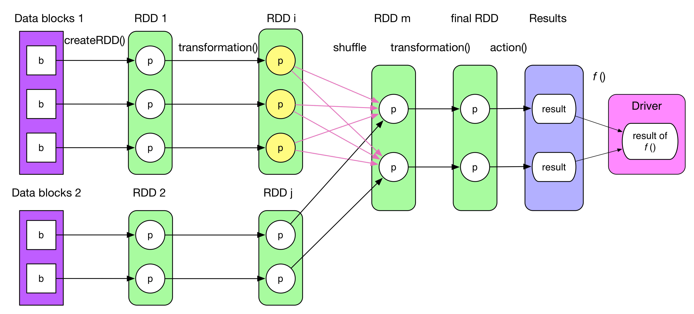
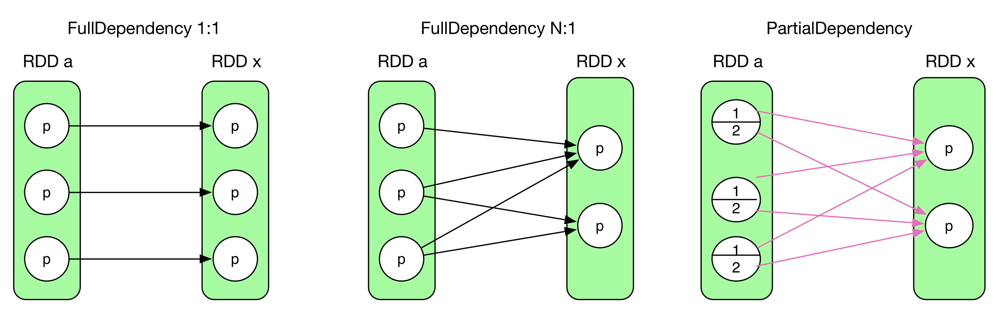
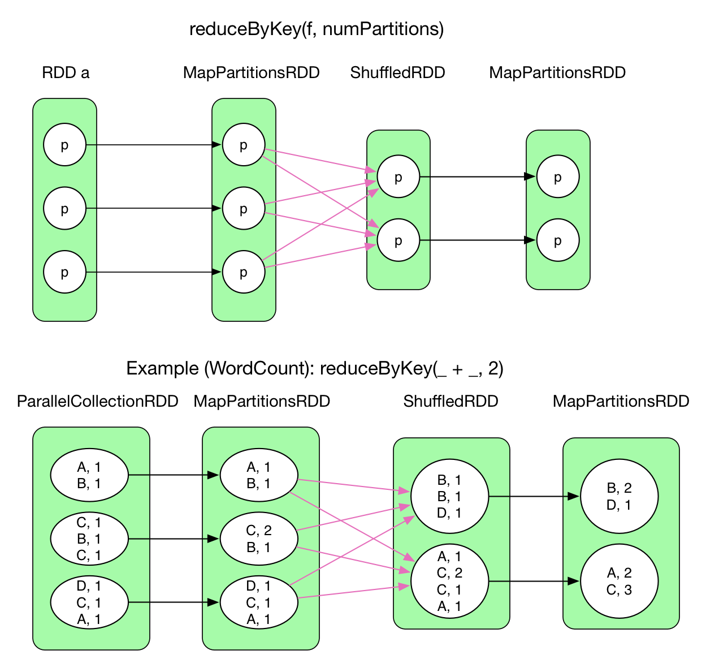
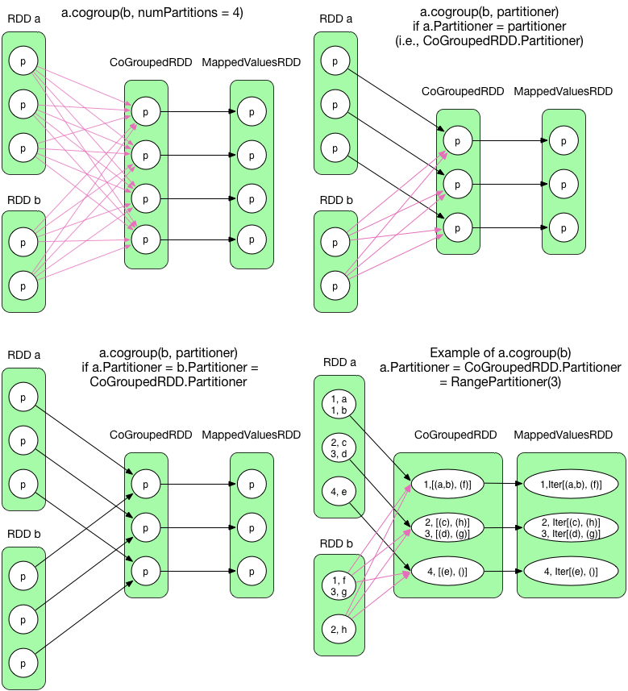

# Job 逻辑执行图

## General logical plan


典型的 Job 逻辑执行图如上所示，经过下面四个步骤可以得到最终执行结果：
- 从数据源（可以是本地 file，内存数据结构， HDFS，HBase 等）读取数据创建最初的 RDD。上一章例子中的 parallelize() 相当于 createRDD()。
- 对 RDD 进行一系列的 transformation() 操作，每一个 transformation() 会产生一个或多个包含不同类型 T 的 RDD[T]。T 可以是 Scala 里面的基本类型或数据结构，不限于 (K, V)。但如果是 (K, V)，K 不能是 Array 等复杂类型（因为难以在复杂类型上定义 partition 函数）。
- 对最后的 final RDD 进行 action() 操作，每个 partition 计算后产生结果 result。
- 将 result 回送到 driver 端，进行最后的 f(list[result]) 计算。例子中的 count() 实际包含了action() 和 sum() 两步计算。

> RDD 可以被 cache 到内存或者 checkpoint 到磁盘上。RDD 中的 partition 个数不固定，通常由用户设定。RDD 和 RDD 之间 partition 的依赖关系可以不是 1 对 1，如上图既有 1 对 1 关系，也有多对多的关系。

## 逻辑执行图的生成

了解了 Job 的逻辑执行图后，写程序时候会在脑中形成类似上面的数据依赖图。然而，实际生成的 RDD 个数往往比我们想想的个数多。

要解决逻辑执行图生成问题，实际需要解决：
- 如何产生 RDD，应该产生哪些 RDD？
- 如何建立 RDD 之间的依赖关系？

### 1. 如何产生 RDD，应该产生哪些 RDD？

解决这个问题的初步想法是让每一个 transformation() 方法返回（new）一个 RDD。事实也基本如此，只是某些 transformation() 比较复杂，会包含多个子 transformation()，因而会生成多个 RDD。这就是*实际 RDD 个数比我们想象的多一些* 的原因。

**如何计算每个 RDD 中的数据？**逻辑执行图实际上是 computing chain，那么 transformation() 的计算逻辑在哪里被 perform？每个 RDD 里有 compute() 方法，负责接收来自上一个 RDD 或者数据源的 input records，perform transformation() 的计算逻辑，然后输出 records。

产生哪些 RDD 与 transformation() 的计算逻辑有关，下面讨论一些典型的 [transformation()](http://spark.apache.org/docs/latest/programming-guide.html#transformations) 及其创建的 RDD。官网上已经解释了每个 transformation 的含义。iterator(split) 的意思是 foreach record in the partition。这里空了很多，是因为那些 transformation() 较为复杂，会产生多个 RDD，具体会在下一节图示出来。

| Transformation |  Generated RDDs | Compute() | 
|:-----|:-------|:---------|
| **map**(func) | MappedRDD | iterator(split).map(f) | 
| **filter**(func) | FilteredRDD | iterator(split).filter(f) | 
| **flatMap**(func) | FlatMappedRDD | iterator(split).flatMap(f) | 
| **mapPartitions**(func) | MapPartitionsRDD | f(iterator(split)) | |
| **mapPartitionsWithIndex**(func) | MapPartitionsRDD |  f(split.index, iterator(split)) | |
| **sample**(withReplacement, fraction, seed) | PartitionwiseSampledRDD | PoissonSampler.sample(iterator(split))  BernoulliSampler.sample(iterator(split)) | 
| **pipe**(command, [envVars]) | PipedRDD | |
| **union**(otherDataset) |  |  |
| **intersection**(otherDataset) | | |
| **distinct**([numTasks])) | | |
| **groupByKey**([numTasks]) | | |
| **reduceByKey**(func, [numTasks]) | | |
| **sortByKey**([ascending], [numTasks]) | | |
| **join**(otherDataset, [numTasks]) | | |
| **cogroup**(otherDataset, [numTasks]) | | |
| **cartesian**(otherDataset) | | |
| **coalesce**(numPartitions) | | |
| **repartition**(numPartitions) | | |


### 2. 如何建立 RDD 之间的联系？

RDD 之间的数据依赖问题实际包括三部分：

- RDD 本身的依赖关系。要生成的 RDD（以后用 RDD x 表示）是依赖一个 parent RDD，还是多个 parent RDDs？
- RDD x 中会有多少个 partition ？
- RDD x 与其 parent RDDs 中 partition 之间是什么依赖关系？是依赖 parent RDD 中一个还是多个 partition？

第一个问题可以很自然的解决，比如`x = rdda.transformation(rddb)` (e.g., x = a.join(b)) 就表示 RDD x 同时依赖于 RDD a 和 RDD b。

第二个问题中的 partition 个数一般由用户指定，不指定的话一般取`max(numPartitions[parent RDD 1], .., numPartitions[parent RDD n])`。

第三个问题比较复杂。需要考虑这个 transformation() 的语义，不同的 transformation() 的依赖关系不同。比如 map() 是 1:1，而 groupByKey() 逻辑执行图中的 ShuffledRDD 中的每个 partition 依赖于 parent RDD 中所有的 partition，还有更复杂的情况。

再次考虑第三个问题，RDD x 中每个 partition 可以依赖于 parent RDD 中一个或者多个 partition。而且这个依赖可以是完全依赖或者部分依赖。部分依赖指的是 parent RDD 中某 partition 中一部分数据与 RDD x 中的一个 partition 相关，另一部分数据与 RDD x 中的另一个 partition 相关。下图展示了完全依赖和部分依赖。



前三个是完全依赖，RDD x 中的 partition 与 parent RDD 中的 partition/partitions 完全相关。最后一个是部分依赖，RDD x 中的 partition 只与 parent RDD 中的 partition 一部分数据相关，另一部分数据与 RDD x 中的其他 partition 相关。

在 Spark 中，完全依赖被称为 NarrowDependency，部分依赖被称为 ShuffleDependency。其实 ShuffleDependency 跟 MapReduce 中 shuffle 的数据依赖相同（mapper 将其 output 进行 partition，然后每个 reducer 会将所有 mapper 输出中属于自己的 partition 通过 HTTP fetch 得到）。

- 第一种 1:1 的情况被称为 OneToOneDependency。
- 第二种 N:1 的情况被称为 N:1 NarrowDependency。
- 第三种 N:N 的情况被称为 N:N NarrowDependency。不属于前两种情况的完全依赖都属于这个类别。
- 第四种被称为 ShuffleDependency。

对于 NarrowDependency，具体 RDD x 中的 partitoin i 依赖 parrent RDD 中一个 partition 还是多个 partitions，是由 RDD x 中的 `getParents(partition i)` 决定（下图中某些例子会详细介绍）。还有一种 RangeDependency 的完全依赖，不过该依赖目前只在 UnionRDD 中使用，下面会介绍。

所以，总结下来 partition 之间的依赖关系如下：
- NarrowDependency (**使用黑色实线或黑色虚线箭头表示**)
	- OneToOneDependency (1:1)
 	- NarrowDependency (N:1)	
	- NarrowDependency (N:N) 
	- RangeDependency (只在 UnionRDD 中使用)
- ShuffleDependency (**使用红色箭头表示**)

之所以要划分 NarrowDependency 和 ShuffleDependency 是为了生成物理执行图，下一章会具体介绍。
> 
> 需要注意的是第三种 NarrowDependency (N:N) 很少在两个 RDD 之间出现。因为如果 parent RDD 中的 partition 同时被 child RDD 中多个 partitions 依赖，那么最后生成的依赖图往往与 ShuffleDependency 一样。只是对于 parent  RDD 中的 partition 来说一个是完全依赖，一个是部分依赖，而箭头数没有少。所以 Spark 定义的 NarrowDependency 其实是 “each partition of the parent RDD is used by at most one partition of the child RDD“，也就是只有 OneToOneDependency (1:1) 和 NarrowDependency (N:1) 两种情况。但是，自己设计的奇葩 RDD 确实可以呈现出 NarrowDependency (N:N)  的情况。这里描述的比较乱，其实看懂下面的几个典型的 RDD 依赖即可。

**如何计算得到 RDD x 中的数据（records）？**下图展示了 OneToOneDependency 的数据依赖，虽然 partition 和 partition 之间是 1:1，但不代表计算 records 的时候也是读一个 record 计算一个 record。 下图右边上下两个 pattern 之间的差别类似于下面两个程序的差别：


code1 of iter.f()
```java
int[] array = {1, 2, 3, 4, 5}
for(int i = 0; i < array.length; i++)
    f(array[i])
``` 
code2 of f(iter)
```java
int[] array = {1, 2, 3, 4, 5}
f(array)
``` 
### 3. 给出一些典型的 transformation() 的计算过程及数据依赖图

**1) union(otherRDD)**


union() 将两个 RDD 简单合并在一起，不改变 partition 里面的数据。RangeDependency 实际上也是 1:1，只是为了访问 union() 后的 RDD 中的 partition 方便，保留了原始 RDD 的 range 边界。


**2) groupByKey(numPartitions)**


上一章已经介绍了 groupByKey 的数据依赖，这里算是*温故而知新* 吧。

groupByKey() 只需要将 Key 相同的 records 聚合在一起，一个简单的 shuffle 过程就可以完成。ShuffledRDD 中的 compute() 只负责将属于每个 partition 的数据 fetch 过来，之后使用 mapPartitions() 操作（前面的 OneToOneDependency 展示过）进行 aggregate，生成 MapPartitionsRDD，到这里 groupByKey() 已经结束。最后为了统一返回值接口，将 value 中的 ArrayBuffer[] 数据结构抽象化成 Iterable[]。

> groupByKey() 没有在 map 端进行 combine，因为 map 端 combine 只会省掉 partition 里面重复 key 占用的空间，当重复 key 特别多时，可以考虑开启 combine。
> 
> 这里的 ArrayBuffer 实际上应该是 CompactBuffer，An append-only buffer similar to ArrayBuffer, but more memory-efficient for small buffers.

ParallelCollectionRDD 是最基础的 RDD，直接从 local 数据结构 create 出的 RDD 属于这个类型，比如
```scala
val pairs = sc.parallelize(List(1, 2, 3, 4, 5), 3)
```
生成的 pairs 就是 ParallelCollectionRDD。  


**2) reduceByKey(func, numPartitions)**



reduceByKey() 相当于传统的 MapReduce，整个数据流也与 Hadoop 中的数据流基本一样。reduceByKey() 默认在 map 端开启 combine()，因此在 shuffle 之前先通过 mapPartitions 操作进行 combine，得到 MapPartitionsRDD，然后 shuffle 得到 ShuffledRDD，然后再进行 reduce（通过 aggregate + mapPartitions() 操作来实现）得到 MapPartitionsRDD。

**3) distinct(numPartitions)**


distinct() 功能是 deduplicate RDD 中的所有的重复数据。由于重复数据可能分散在不同的 partition 里面，因此需要 shuffle 来进行 aggregate 后再去重。然而，shuffle 要求数据类型是 `<K, V>`。如果原始数据只有 Key（比如例子中 record 只有一个整数），那么需要补充成 `<K, null>`。这个补充过程由 map() 操作完成，生成 MappedRDD。然后调用上面的 reduceByKey() 来进行 shuffle，在 map 端进行 combine，然后 reduce 进一步去重，生成 MapPartitionsRDD。最后，将 `<K, null>` 还原成 K，仍然由 map() 完成，生成 MappedRDD。蓝色的部分就是调用的 reduceByKey()。

**4) cogroup(otherRDD, numPartitions)**



与 groupByKey() 不同，cogroup() 要 aggregate 两个或两个以上的 RDD。**那么 CoGroupedRDD 与 RDD a 和 RDD b 的关系都必须是 ShuffleDependency 么？是否存在 OneToOneDependency？**

首先要明确的是 CoGroupedRDD 存在几个 partition 可以由用户直接设定，与 RDD a 和 RDD b 无关。然而，如果 CoGroupedRDD 中 partition 个数与 RDD a/b 中的 partition 个数不一样，那么不可能存在 1:1 的关系。

再次，cogroup() 的计算结果放在 CoGroupedRDD 中哪个 partition 是由用户设置的 partitioner 确定的（默认是 HashPartitioner）。那么可以推出：即使 RDD a/b 中的 partition 个数与 CoGroupedRDD 中的一样，如果 RDD a/b 中的 partitioner 与 CoGroupedRDD 中的不一样，也不可能存在 1:1 的关系。比如，在上图的 example 里面，RDD a 是 RangePartitioner，b 是 HashPartitioner，CoGroupedRDD 也是 RangePartitioner 且 partition 个数与 a 的相同。那么很自然地，a 中的每个 partition 中 records 可以直接送到 CoGroupedRDD 中对应的 partition。RDD b 中的 records 必须再次进行划分与 shuffle 后才能进入对应的 partition。

最后，经过上面分析，**对于两个或两个以上的 RDD 聚合，当且仅当聚合后的 RDD 中 partitioner 类别及 partition 个数与前面的 RDD 都相同，才会与前面的 RDD 构成 1:1 的关系。否则，只能是 ShuffleDependency。**这个算法对应的代码可以在`CoGroupedRDD.getDependencies()` 中找到，虽然比较难理解。

> Spark 代码中如何表示 CoGroupedRDD 中的 partition 依赖于多个 parent RDDs 中的 partitions？
> 
> 首先，将 CoGroupedRDD 依赖的所有 RDD 放进数组 rdds[RDD] 中。再次，foreach i，如果 CoGroupedRDD 和 rdds(i) 对应的 RDD 是 OneToOneDependency 关系，那么 Dependecy[i] = new OneToOneDependency(rdd)，否则 = new ShuffleDependency(rdd)。最后，返回与每个 parent RDD 的依赖关系数组 deps[Dependency]。
> 
> Dependency 类中的 getParents(partition id) 负责给出某个 partition 按照该 dependency 所依赖的 parent RDD 中的 partitions: List[Int]。
> 
> getPartitions() 负责给出 RDD 中有多少个 partition，以及每个 partition 如何序列化。

**5) intersection(otherRDD)**


intersection() 功能是抽取出 RDD a 和 RDD b 中的公共数据。先使用 map() 将 RDD[T] 转变成 RDD[(T, null)]，这里的 T 只要不是 Array 等集合类型即可。接着，进行 a.cogroup(b)，蓝色部分与前面的 cogroup() 一样。之后再使用 filter() 过滤掉 [iter(groupA()), iter(groupB())] 中 groupA 或 groupB 为空的 records，得到 FilteredRDD。最后，使用 keys() 只保留 key 即可，得到 MappedRDD。

6) **join(otherRDD, numPartitions)**


join() 将两个 RDD[(K, V)] 按照 SQL 中的 join 方式聚合在一起。与 intersection() 类似，首先进行 cogroup()，得到`<K,  (Iterable[V1], Iterable[V2])>`类型的 MappedValuesRDD，然后对 Iterable[V1] 和 Iterable[V2] 做笛卡尔集，并将集合 flat() 化。

这里给出了两个 example，第一个 example 的 RDD 1 和 RDD 2 使用 RangePartitioner 划分，而 CoGroupedRDD 使用 HashPartitioner，与 RDD 1/2 都不一样，因此是 ShuffleDependency。第二个 example 中， RDD 1 事先使用 HashPartitioner 对其 key 进行划分，得到三个 partition，与 CoGroupedRDD 使用的 HashPartitioner(3) 一致，因此数据依赖是 1:1。如果 RDD 2 事先也使用 HashPartitioner 对其 key 进行划分，得到三个 partition，那么 join() 就不存在 ShuffleDependency 了，这个 join() 也就变成了 hashjoin()。

**7) sortByKey(ascending, numPartitions)**


sortByKey() 将 RDD[(K, V)] 中的 records 按 key 排序，ascending = true 表示升序，false 表示降序。目前 sortByKey() 的数据依赖很简单，先使用 shuffle 将 records 聚集在一起（放到对应的 partition 里面），然后将 partition 内的所有 records 按 key 排序，最后得到的 MapPartitionsRDD 中的 records 就有序了。

>目前 sortByKey()  先使用 Array 来保存 partition 中所有的 records，再排序。

**8) cartesian(otherRDD)**


Cartesian 对两个 RDD 做笛卡尔集，生成的 CartesianRDD 中 partition 个数 = partitionNum(RDD a) * partitionNum(RDD b)。

这里的依赖关系与前面的不太一样，CartesianRDD 中每个partition 依赖两个 parent RDD，而且其中每个 partition 完全依赖 RDD a 中一个 partition，同时又完全依赖 RDD b 中另一个 partition。这里没有红色箭头，因为所有依赖都是 NarrowDependency。

> CartesianRDD.getDependencies() 返回 rdds[RDD a, RDD b]。CartesianRDD 中的 partiton i 依赖于 (RDD a).List(i / numPartitionsInRDDb) 和 (RDD b).List(i % numPartitionsInRDDb)。

**9) coalesce(numPartitions, shuffle = false)**


coalesce() 可以将 parent RDD 的 partition 个数进行调整，比如从 5 个减少到 3 个，或者从 5 个增加到 10 个。需要注意的是当 shuffle = false 的时候，是不能增加 partition 个数的（不能从 5 个变为 10 个）。

coalesce() 的核心问题是**如何确立 CoalescedRDD 中 partition 和其 parent RDD 中 partition 的关系。**

- coalesce(shuffle = false) 时，由于不能进行 shuffle，**问题变为 parent RDD 中哪些partition 可以合并在一起。**合并因素除了要考虑 partition 中元素个数外，还要考虑 locality 及 balance 的问题。因此，Spark 设计了一个非常复杂的算法来解决该问题（算法部分我还没有深究）。注意`Example: a.coalesce(3, shuffle = false)`展示了 N:1 的 NarrowDependency。
- coalesce(shuffle = true) 时，**由于可以进行 shuffle，问题变为如何将 RDD 中所有 records 平均划分到 N 个 partition 中。**很简单，在每个 partition 中，给每个 record 附加一个 key，key 递增，这样经过 hash(key) 后，key 可以被平均分配到不同的 partition 中，类似 Round-robin 算法。在第二个例子中，RDD a 中的每个元素，先被加上了递增的 key（如 MapPartitionsRDD 第二个 partition 中 (1, 3) 中的 1）。在每个 partition 中，第一个元素 (Key, Value) 中的 key 由 `var position = (new Random(index)).nextInt(numPartitions);position = position + 1` 计算得到，index 是该 partition 的索引，numPartitions 是 CoalescedRDD 中的 partition 个数。接下来元素的 key 是递增的，然后 shuffle 后的 ShuffledRDD 可以得到均分的 records，然后经过复杂算法来建立 ShuffledRDD 和 CoalescedRDD 之间的数据联系，最后过滤掉 key，得到 coalesce 后的结果 MappedRDD。

**10) repartition(numPartitions)**

等价于 coalesce(numPartitions, shuffle = true)

## Primitive transformation()
**combineByKey()**

**分析了这么多 RDD 的逻辑执行图，它们之间有没有共同之处？如果有，是怎么被设计和实现的？**

仔细分析 RDD 的逻辑执行图会发现，ShuffleDependency 左边的 RDD 中的 record 要求是 &lt;key, value&gt; 型的，经过 ShuffleDependency 后，包含相同 key 的 records 会被 aggregate 到一起，然后在 aggregated 的 records 上执行不同的计算逻辑。实际执行时（后面的章节会具体谈到）很多 transformation() 如 groupByKey()，reduceByKey() 是边 aggregate 数据边执行计算逻辑的，因此共同之处就是 **aggregate 同时 compute()**。Spark 使用 combineByKey() 来实现这个 aggregate + compute() 的基础操作。

combineByKey() 的定义如下：
```scala
 def combineByKey[C](createCombiner: V => C,
      mergeValue: (C, V) => C,
      mergeCombiners: (C, C) => C,
      partitioner: Partitioner,
      mapSideCombine: Boolean = true,
      serializer: Serializer = null): RDD[(K, C)]
```
其中主要有三个参数 createCombiner，mergeValue 和 mergeCombiners。简单解释下这三个函数及 combineByKey() 的意义，注意它们的类型：

假设一组具有相同 K 的 &lt;K, V&gt; records 正在一个个流向 combineByKey()，createCombiner 将第一个 record 的 value 初始化为 c （比如，c = value），然后从第二个 record 开始，来一个 record 就使用 mergeValue(c, record.value) 来更新 c，比如想要对这些 records 的所有 values 做 sum，那么使用 c = c + record.value。等到 records 全部被 mergeValue()，得到结果 c。假设还有一组 records（key 与前面那组的 key 均相同）一个个到来，combineByKey() 使用前面的方法不断计算得到 c'。现在如果要求这两组 records 总的 combineByKey() 后的结果，那么可以使用 final c = mergeCombiners(c, c') 来计算。

## Discussion
至此，我们讨论了如何生成 job 的逻辑执行图，这些图也是 Spark 看似简单的 API 背后的复杂计算逻辑及数据依赖关系。

整个 job 会产生哪些 RDD 由 transformation() 语义决定。一些 transformation()， 比如 cogroup() 会被很多其他操作用到。

RDD 本身的依赖关系由 transformation() 生成的每一个 RDD 本身语义决定。如 CoGroupedRDD 依赖于所有参加 cogroup() 的 RDDs。

RDD 中 partition 依赖关系分为 NarrowDependency 和 ShuffleDependency。前者是完全依赖，后者是部分依赖。NarrowDependency 里面又包含多种情况，只有前后两个 RDD 的 partition 个数以及 partitioner 都一样，才会出现 NarrowDependency。

从数据处理逻辑的角度来看，MapReduce 相当于 Spark 中的 map() + reduceByKey()，但严格来讲 MapReduce 中的 reduce() 要比 reduceByKey() 的功能强大些，详细差别会在 Shuffle details 一章中继续讨论。
