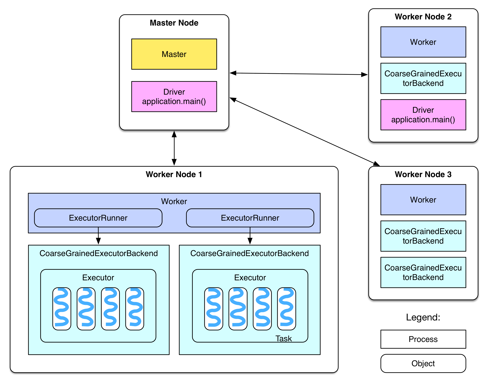
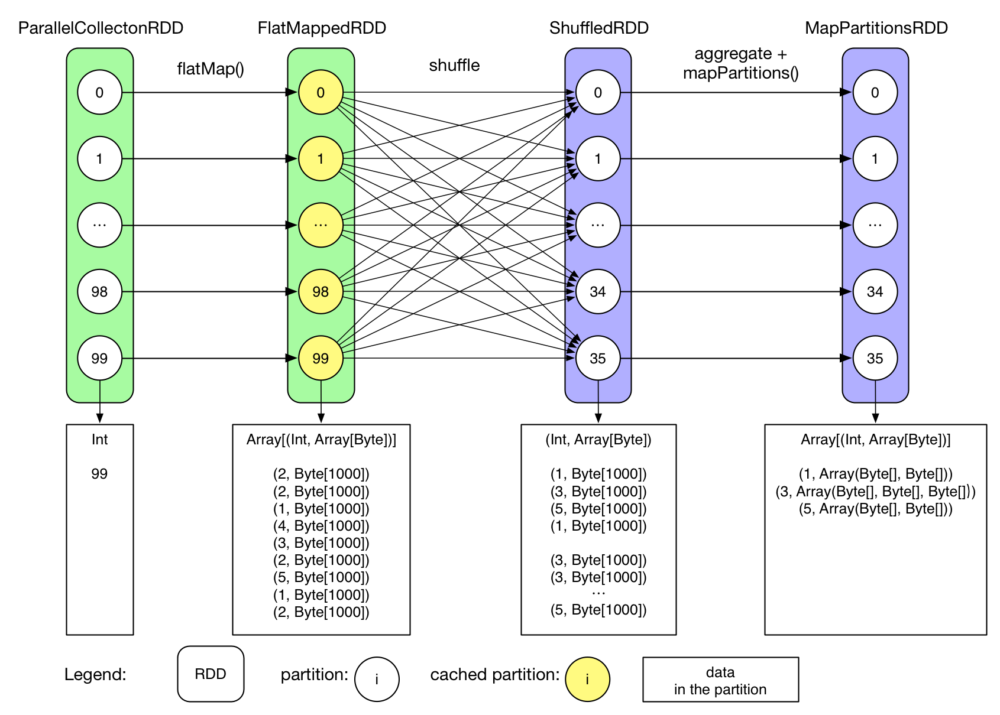
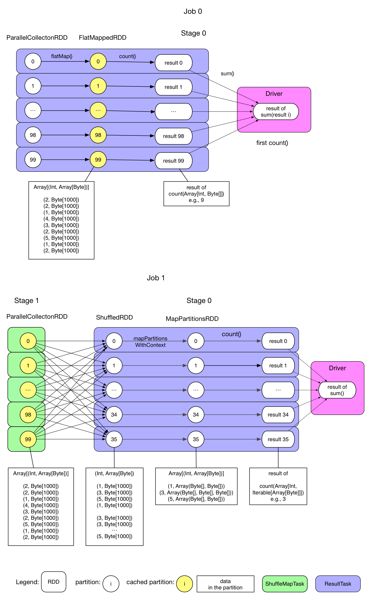

## Overview

Firstly we'll have a look at Spark's deployment. The question here is: **after a successful deployment, what are the services launched by each node of the cluster?**

## Deployment Diagram


We can see from the diagram:
  - There's Master node and Worker node in the cluster, they are equivalent to Hadoop's Master and Slave node
  - Master node has a Master daemon process, managing all worker nodes
  - Worker node has a Worker daemon process, responsible for communicating with the master node and for managing local executors
  - In the official document, the Driver is explained as "The process running the main() function of the application and creating the SparkContext". The application is the user's program (driver program), such as WordCount.scala. If the driver program is running on the Master node, for example if we run the this on the Master node

```scala
./bin/run-example SparkPi 10
```
Then the SparkPi program will be the Driver on the Master node. In case of a YARN cluster, the Driver may be scheduled to a Worker node (for example Worker node 2 in the diagram). If the driver program is run on a local PC, such as running from within Eclipse with

```scala
val sc = new SparkContext("spark://master:7077", "AppName")
```
Then the driver program will be on the local machine. However this is not a recommended way of running Spark since the local machine may not be in the same network with the Worker nodes, which will slow down the communication between the driver and the executors

  - There may have one or multiple ExecutorBackend processes in each Worker node, each one possesses an Executor instance. Each Executor object maintains a thread pool. Each task runs on a thread.
  - Each application has one driver and multiple executors. All tasks within the same executor belongs to the same application
  - In Standalone deployment mode, ExecutorBackend is instantiated as CoarseGrainedExecutorBackend

    > In my cluster there's only one CoarseGrainedExecutorBackend process on each worker and I didn't manage to configure multiple instances of it (my guess is that there'll be multiple CoarseGrainedExecutorBackend process when when multiple applications are running, need to be confirmed).
    > Check this blog (in Chinese) [Summary on Spark Executor Driver Resource Scheduling](http://blog.csdn.net/oopsoom/article/details/38763985) by [@OopsOutOfMemory](http://weibo.com/oopsoom) if you want to know more about the relation between Worker and Executor.

  - Worker controls the CoarseGrainedExecutorBackend by using a ExecutorRunner

After the deployment diagram, we'll examine an example job to see how a Spark job is created and executed.

## Example Spark Job
The example here is the GroupByTest application under the examples package in Spark. We assume that the application is run on the Master node, with the following command:

```scala
/* Usage: GroupByTest [numMappers] [numKVPairs] [valSize] [numReducers] */

bin/run-example GroupByTest 100 10000 1000 36
```

The code of this application is the following:

```scala
package org.apache.spark.examples

import java.util.Random

import org.apache.spark.{SparkConf, SparkContext}
import org.apache.spark.SparkContext._

/**
  * Usage: GroupByTest [numMappers] [numKVPairs] [valSize] [numReducers]
  */
object GroupByTest {
  def main(args: Array[String]) {
    val sparkConf = new SparkConf().setAppName("GroupBy Test")
    var numMappers = 100
    var numKVPairs = 10000
    var valSize = 1000
    var numReducers = 36

    val sc = new SparkContext(sparkConf)

    val pairs1 = sc.parallelize(0 until numMappers, numMappers).flatMap { p =>
      val ranGen = new Random
      var arr1 = new Array[(Int, Array[Byte])](numKVPairs)
      for (i <- 0 until numKVPairs) {
        val byteArr = new Array[Byte](valSize)
        ranGen.nextBytes(byteArr)
        arr1(i) = (ranGen.nextInt(Int.MaxValue), byteArr)
      }
      arr1
    }.cache
    // Enforce that everything has been calculated and in cache
    pairs1.count

    println(pairs1.groupByKey(numReducers).count)

    sc.stop()
  }
}

```

After reading the code, we should have an idea about how the data get transformed:


This is not a complicated application, let's estimate the data size and the result:

  1. Initialize SparkConf
  2. Initialize numMappers=100, numKVPairs=10,000, valSize=1000, numReducers= 36
  3. Initialize SparkContext. This is an important step, the SparkContext contains objectes and actors that are needed for the creation of a driver
  4. For each mapper, a `arr1: Array[(Int, Byte[])]` is created, with a length of numKVPairs. Each byte array's size is valSize, a randomly generated integer. We may estimate `Size(arr1) = numKVPairs * (4 + valSize) = 10MB`, and we have `Size(pairs1) = numMappers * Size(arr1) ＝1000MB`
  5. Each mapper is instructed to cache its `arr1` array into the memory
  6. Then an action, count(), is applied to compute the size of `arr1` for all mappers, the result is `numMappers * numKVPairs = 1,000,000`. This action triggers the caching of `arr1`s
  7. groupByKey operation is executed on `pairs1` which is already cached. The reducer number (or partition number) is numReducers. Theoretically, if hash(key) is well distributed, each reducer receives `numMappers * numKVPairs / numReducer ＝ 27,777` pairs of (Int, Array[Byte]), with a size of `Size(pairs1) / numReducer = 27MB`
  8. Reducer aggregates the records with the same Int key, the result is `(Int, List(Byte[], Byte[], ..., Byte[]))`
  9. Finally a count action sums up the record number in each reducer, the final result is actually the number of distinct integers in `paris1`

## Logical Plan

The actual execution process of an application is more complicated than the above diagram. Generally speaking, a logical plan (or data dependency graph) will be created, then a physical plan (in the form of a DAG) will be generated. After that, concrete tasks will be generated and executed. Let's check the logical plan of this application:

A call of function `RDD.toDebugString` will return the logical plan:

```scala
  MapPartitionsRDD[3] at groupByKey at GroupByTest.scala:51 (36 partitions)
    ShuffledRDD[2] at groupByKey at GroupByTest.scala:51 (36 partitions)
      FlatMappedRDD[1] at flatMap at GroupByTest.scala:38 (100 partitions)
        ParallelCollectionRDD[0] at parallelize at GroupByTest.scala:38 (100 partitions)
```

We can also draw a diagram:


> Notice that the `data in the partition` blocks shows the final result of the partitions, this does not necessarily mean that all these data resides in the memory in the same time

So we could conclude:
  - User initiated an array from 0 to 99: `0 until numMappers`
  - parallelize() generate the initial ParallelCollectionRDD, each partititon contains an integer i
  - FlatMappedRDD is generated by calling a transformation method (flatMap) on the ParallelCollectionRDD. Each partition of the FlatMappedRDD contains an `Array[(Int, Array[Byte])]`
  - When the first count() executes, this action executes on each partition, the results are sent to the driver and are summed up in the driver
  - Since the FlatMappedRDD is cached in memory, so its partitions are colored differently
  - groupByKey() generates the following 2 RDDs (ShuffledRDD and MapPartitionsRDD), we'll see in later chapters why it is the case
  - Usually we see a ShuffleRDD if the job needs a shuffle. Its relation with the former RDD is similar to the relation between the output of mappers and the input of reducers in Hadoop
  - MapPartitionRDD contains groupByKey()'s result
  - Each value in MapPartitionRDD (`Array[Byte]`) is converted to `Iterable`
  - The last count() action is executed in the same way as we explained above

**We can see that the logical plan describes the data flow of the application: the transformations that are applied to the data, the intermediate RDDs and the dependency between these RDDs.**

## Physical Plan

As we've found out, the logical plan is about the dependency of data, not the actual execution of tasks. This is a main difference compared to Hadoop. In Hadoop, user handles directly the physical tasks: mapper tasks for applying operations on partitions and reducers tasks for aggregation. This is because in Hadoop, the data flow is pre-defined and fixed, user just fills in the map() and reduce() function. While in Spark, the data flow is very flexible and could be complicated, so it's difficult to simply combine together the concept of  data dependency and the physical tasks. For this reason, Spark separates the data flow and the actual task execution process, and has algorithms to transform a logical plan into a physical plan. We'll discuss this transformation in later chapter.

For the example job, let's draw its physical DAG:


We can see that the GroupByTest application generates 2 jobs, the first job is triggered by the first action (that is `pairs1.count()`). Let's check this first job:

  - The job contains only 1 stage (now we only need to know that there's a concept called stage, we'll see it in detail in later chapters)
  - Stage 0 has 100 ResultTask
  - Each task computes flatMap, generating FlatMappedRDD, then executes the action (`count()`), count the record number in each partition. For example in partition 99 there's only 9 records.
  - Since `pairs1` is instructed to be cached, the tasks will cache the partitions of FlatMappedRDD inside the executor's memory space.
  - After the tasks' execution, drive collects the results of tasks and sums them up
  - Job 0 completes

The second job is triggered by `pairs1.groupByKey(numReducers).count`:

  - There's 2 stages in this job
  - Stage 0 contains 100 ShuffleMapTask, each task reads a part of `paris1` from the cache, partitions it, and write the partition results on local disk. For example, the task will place the a record `(1, Array(...))` in the bucket of key 1 and store it on the disk. This step is similar to the partitioning of mappers in Hadoop
  - Stage 1 contains 36 ResultTask, each task fetches and shuffles the data that it need to process. It does aggregation in the same time as fetching data and the mapPartitions() operation, then count() is applied to get the result. For example the ResultTask responsible for bucket 3 will fetch all data of bucket 3 from the workers and aggregates them locally
  - After the tasks' execution, drive collects the results of tasks and sum them up
  - Job 1 completes

We can see that the physical plan is not simple. An Spark application can contain multiple jobs, each job could have multiple stages, and each stage has multiple tasks. **Later we'll see how the jobs are defined as well as how the stages and tasks are created**

## Discussion
So now we have a basic knowledge about a Spark job's creation and execution. We also discussed the cache feature of Spark.
In the following chapters we'll discuss in detail the key steps related to job creation and execution, including:
  1. logical plan generation
  2. physical plan generation
  3. Job submission and scheduling
  4. Task's creation, execution and result handling
  5. How shuffle is done in Spark
  6. Cache mechanism
  7. Broadcast mechanism
