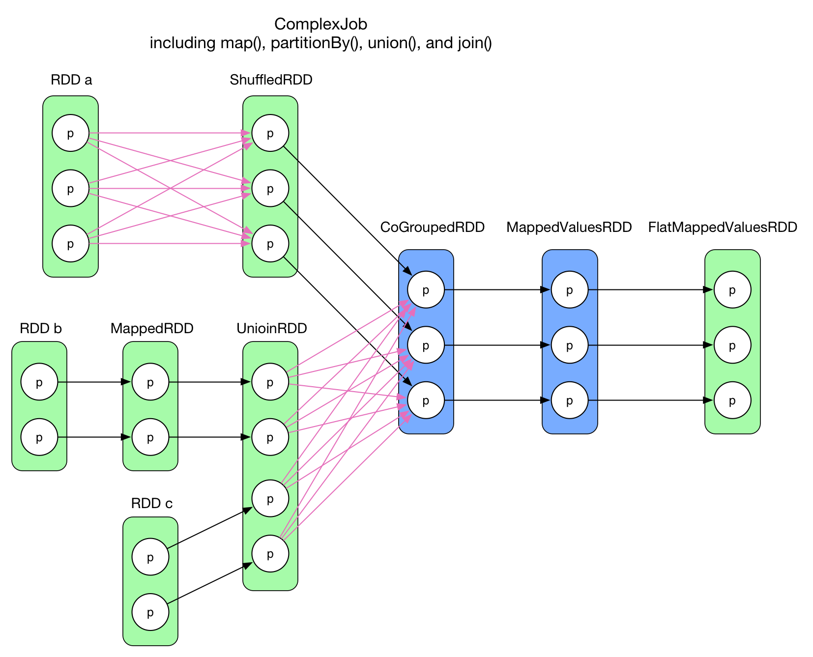
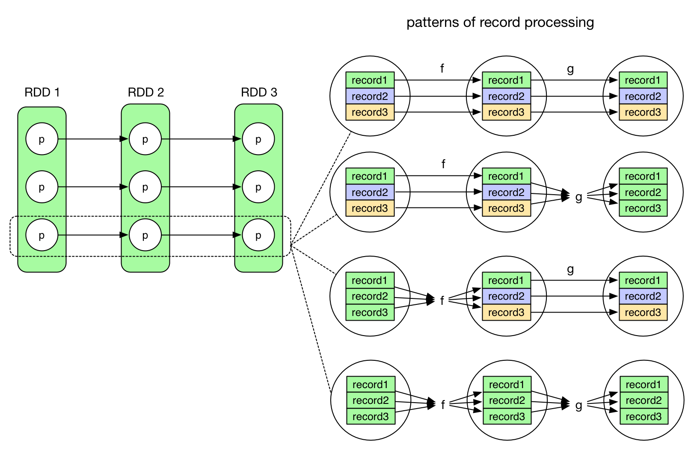
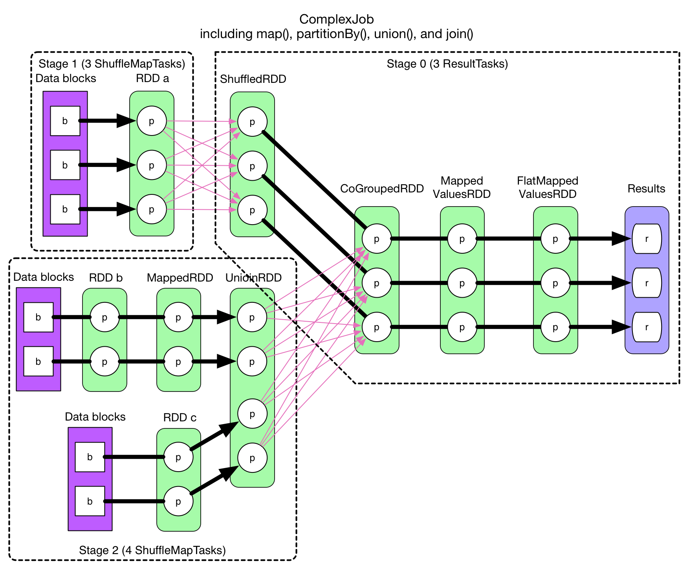
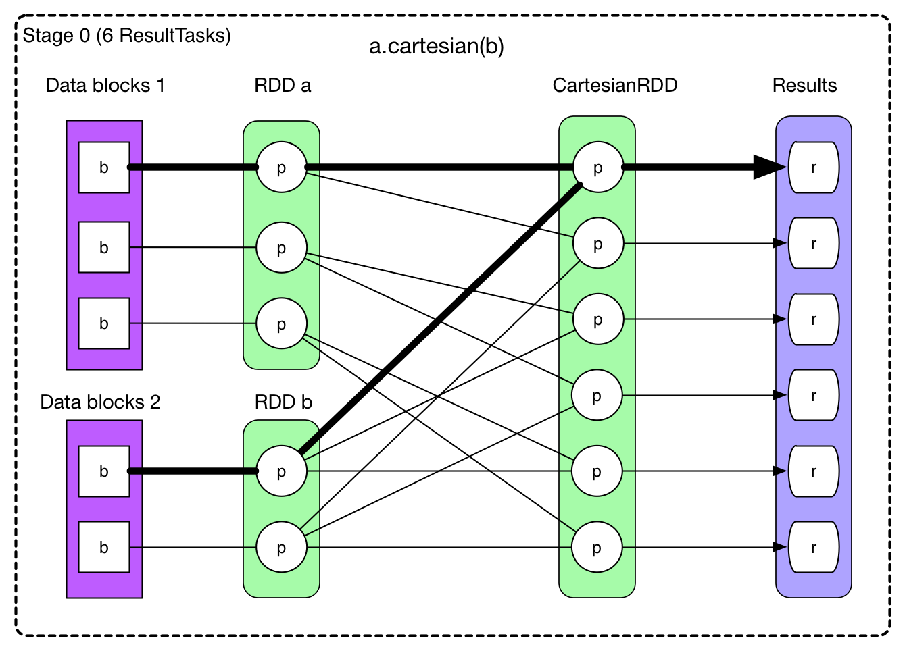

# Physical Plan

We have briefly introduced the DAG-like physical plan, which contains stages and tasks. In this chapter, we'll look at **how the physical plan (so the stages and tasks) is generated given a logical plan of a Spark application.**

## A Complex Logical Plan


The code of this application is attached at the end of this chapter.

**How to properly define stages and determine the tasks with such a complex data dependency graph?**

An intuitive idea is to associate one RDD and its preceding RDD to form a stage, in this way each arrow in the above graph will become a task. For the case of 2 RDDs aggregates into one, we may create a stage with these 3 RDDs. This strategy could be a working solution, but will not be efficient. It has a subtle, but severe problem: **lots of intermediate data needs to be stored**. For a physical task, its result will be stored either on local disk, or in the memory, or both. If a task is generated for each arrow in the data dependency graph, the system needs to store data of all the RDDs. It will cost a lot.

If we examine the logical plan more closely, we may find out that in each RDD, the partitions are independent from each other. That is to say, inside each RDD, the data within a partition will not interfere others. With this observation, an aggressive idea is to consider the whole diagram as a single stage and create one physical task for each partition of the final RDD (`FlatMappedValuesRDD`). The following diagram illustrates this idea:


All thick arrows in above diagram belong to task1 whose result is the first partition of the final RDD of the job. Note that in order to compute the first partition of the `CoGroupedRDD`, we need to evaluate all partitions of its preceding RDDs since it's a `ShuffleDependency`. So in the computation of task1, we can also take the chance to compute the `CoGroupedRDD`'s second and third partition, for task2 and task3 respecively. As a result, the task2 and task3 are simpler. They are represented by thin arrows and dashed arrows in the diagram.

However, there's 2 problems with this idea:
  - The first task is big. Because of the `ShuffleDependency`, we have to evaluate all the partitions of the preceding RDDs.
  - Need to design clever algorithms to determine which are the partitions to cache.

But there's also one good point in this idea, that is to **pipeline the data: the data is computed when they are actually needed in a flow fashion**. For example in the first task, we check backwards from the final RDD (`FlatMappedValuesRDD`) to see which are the RDDs and partitions that are actually needed to be evaluated. And between the RDDs with `NarrowDependency` relation, no intermediate data needs to be stored.

It will be clearer to understand the pipelining if we consider a record-level point of view. The following diagram illustrates different evaluation patterns for RDDs with `NarrowDependency`.



The first pattern (pipeline pattern) is equivalent to:

```scala
for (record <- records) {
  f(g(record))
}
```

Consider `records` as a stream, we can see that no intermediate result need to be stored.Once the computation `f(g(record))` is done, the result will be stored and the record line could be garbarge collected. But for other patterns, for example the third pattern, this is not the case:

```scala
for (record <- records) {
  val fResult = f(record)
  store(fResult)  // need to store the intermediate result here
}

for (record <- fResult) {
  g(record)
  ...
}
```

It's clear that `f`'s result need to be stored somewhere.


Let's go back to our problem with stages and tasks. The main issue of our aggressive idea is that we can't actually pipelines then data flow if there's a `ShuffleDependency`. Then how about to cut the data flow at each `ShuffleDependency`? That leaves us with chains of RDDs connected by `NarrowDependency` and we know that `NarrowDependency` can be pipelined. So we can just divide the logical plan into stages like this:



The strategy for creating stages is to: **check backwards from the final RDD, add each `NarrowDependency` into the current stage and break out for a new stage when there's a `ShuffleDependency`. In each stage, the task number is determined by the partition number of the last RDD in the stage.**

In above diagram, all thick arrows represent tasks. Since the stages are determined backwards, the last stage's id is 0, stage 1 and stage 2 are both parents of stage 0. **If a stage gives the final result, then its tasks are of type `ResultTask`, otherwise they are `ShuffleMapTask`.** `ShuffleMapTask` gets its name because its result needs to be shuffled before goes into the next stage, it's similar to the mappers in Hadoop MapReduce. `ResultTask` can be seen as reducer in Hadoop (if it gets shuffled data from its parent stage), or it could be mapper (if the stage has no parent).

One problem remains: `NarrowDependency` chain can be pipelined, but in our example application, we've showed only `OneToOneDependency` and `RangeDependency`, how about other `NarrowDependency`?

Let's check back the cartesian operation in the last chapter with complex `NarrowDependency` inside:


With stages:



The thick arrows represents the first `ResultTask`. Since the stage gives directly the final result, in above diagram we have 6 `ResultTask`. Different with `OneToOneDependency`, each `ResultTask` in this job needs to evaluate 3 RDDs and read 2 data blocks, all executed in one single task. **We can see that regardless of the actual type of `NarrowDependency`, be it 1:1 or N:N, `NarrowDependency` chain can always be pipelined. The number of task needed is the same as the partition number in the final RDD.**

## Execution of the Physical Plan
We have stages and tasks, next problem: **how the tasks are executed for the final result?**

Let's go back to the physical plan of our example application of the chapter. Recall that in Hadoop MapReduce, the tasks are executed in order, `map()` generates map outputs, which in term gets partitioned and written to local disk. Then `shuffle-sort-aggregate` process is applied to generate reduce inputs. Finally `reduce()` executes for the final result. This process is illustrated in the following diagram:


This execution process can not be used directly on Spark's physical plan since Hadoop MapReduce's physical plan is simple and fixed, and without pipelining.

The main idea of pipelining is that **the data is computed when they are actually needed in a flow fashion.** We start from the final result (this is obviously where the computation is needed) and check backwards the RDD chain to find what are the RDDs and partitions that need to be evaluated for computing the final result. In most cases, we trace back to some partitions in the leftmost RDD and they are the first to be evaluated.

**For a stage without parent, its leftmost RDD can be evaluate directly (it has no dependency), and each record evaluated can be streamed into the subsequent computations (pipelining).** The computation chain is deduced backwards from the final step, but the actual execution streams the records forwards. One record goes through the whole computation chain before the computation of the next record starts.

For stages with parent, we need to execute its parent stages and fetch the data through shuffle. Once it's done, it becomes the same case as a stage without parent.

> In the code, each RDD's `getDependency()` method declares its data dependency. `compute()` method is in charge of receiving upstream records (from parent RDD or data source) and applying computation logic. We see often code like this in RDDs: `firstParent[T].iterator(split, context).map(f)`. `firstParent` is the first dependent RDD, `iterator()` shows that the records are consumed one by one, and `map(f)` applies the computation logic on each record. The `compute()` method returns an iterator for next computation.

Summary so far: **The whole computation chain is created by checking backwards the data depency from the last RDD. Each `ShuffleDependency` separates stages. In each stage, each RDD's `compute()` method calls `parentRDD.itererator()` to receive the upstream record stream.**

Notice that `compute()` method is reserved only for computation logic that generates output records from parent RDDs. The actual dependent RDDs are declared in `getDependency()` method. The actual dependent partitions are declared in `dependency.getParents()` method.

Let's check the `CartesianRDD` as an example:

```scala
 // RDD x is the cartesian product of RDD a and RDD b
 // RDD x = (RDD a).cartesian(RDD b)
 // Defines how many partitions RDD x should have, what are the types for each partition
 override def getPartitions: Array[Partition] = {
    // create the cross product split
    val array = new Array[Partition](rdd1.partitions.size * rdd2.partitions.size)
    for (s1 <- rdd1.partitions; s2 <- rdd2.partitions) {
      val idx = s1.index * numPartitionsInRdd2 + s2.index
      array(idx) = new CartesianPartition(idx, rdd1, rdd2, s1.index, s2.index)
    }
    array
  }

  // Defines the computation logic for each partition of RDD x (the result RDD)
  override def compute(split: Partition, context: TaskContext) = {
    val currSplit = split.asInstanceOf[CartesianPartition]
    // s1 shows that a partition in RDD x depends on one partition in RDD a
    // s2 shows that a partition in RDD x depends on one partition in RDD b
    for (x <- rdd1.iterator(currSplit.s1, context);
         y <- rdd2.iterator(currSplit.s2, context)) yield (x, y)
  }

  // Defines which are the dependent partitions and RDDs for partition i in RDD x
  //
  // RDD x depends on RDD a and RDD b, both in `NarrowDependency`
  // For the first dependency, partition i in RDD x depends on the partition with
  //     index `i / numPartitionsInRDD2` in RDD a
  // For the second dependency, partition i in RDD x depends on the partition with
  //     index `i % numPartitionsInRDD2` in RDD b
  override def getDependencies: Seq[Dependency[_]] = List(
    new NarrowDependency(rdd1) {
      def getParents(id: Int): Seq[Int] = List(id / numPartitionsInRdd2)
    },
    new NarrowDependency(rdd2) {
      def getParents(id: Int): Seq[Int] = List(id % numPartitionsInRdd2)
    }
  )
```

## Job Creation

Now we've introduced the logical plan and physical plan, then **how and when a job is created? What exactly is a job?**

The following table shows the typical [action()](http://spark.apache.org/docs/latest/programming-guide.html#actions). The second column is `processPartition()` method, it defines how to process the records in each partition for the result. The third column is `resultHandler()` method, it defines how to process the partial results from each partition to form the final result.

| Action | finalRDD(records) => result | compute(results) |
|:---------| :-------|:-------|
| reduce(func) | (record1, record2) => result, (result, record i) => result | (result1, result 2) => result, (result, result i) => result
| collect() |Array[records] => result | Array[result] |
| count() | count(records) => result | sum(result) |
| foreach(f) | f(records) => result | Array[result] |
| take(n) | record (i<=n) => result | Array[result] |
| first() | record 1 => result | Array[result] |
| takeSample() | selected records => result | Array[result] |
| takeOrdered(n, [ordering]) | TopN(records) => result | TopN(results) |
| saveAsHadoopFile(path) | records => write(records) | null |
| countByKey() | (K, V) => Map(K, count(K)) | (Map, Map) => Map(K, count(K)) |

Each time there's an `action()` in user's driver program, a job will be created. For example `foreach()` action will call `sc.runJob(this, (iter: Iterator[T]) => iter.foreach(f)))` to submit a job to the `DAGScheduler`. If there's other `action()`s in the driver program, there will be other jobs submitted. So we'll have as many jobs as the `action()` operations in a driver program. This is why in Spark a driver program is called an application rather than a job.

The last stage of a job generates the job's result. For example in the `GroupByTest` in the first chapter, there're 2 jobs with 2 sets of results. When a job is submitted, the `DAGScheduler` applies the strategy to figure out the stages, and submits firstly the **stages without parents** for execution. In this process, the number and type of tasks are also determined. A stage is executed after its parent stages' execution.

## Details in Job Submission

Let's briefly analyze the code for job creation and submission. We'll come back to this part in the Architecture chapter.

1. `rdd.action()` calls `DAGScheduler.runJob(rdd, processPartition, resultHandler)` to create a job.
2. `runJob()` gets the partition number and type of the final RDD by calling `rdd.getPartitions()`. Then it allocates `Array[Result](partitions.size)` for holding the results based on the partition number.
3. Finally `runJob(rdd, cleanedFunc, partitions, allowLocal, resultHandler)` in `DAGScheduler` is called to submit the job. `cleanedFunc` is the closure-cleaned version of `processPartition`. In this way this function can be serialized and sent to the different worker nodes.
4. `DAGScheduler`'s `runJob()` calls `submitJob(rdd, func, partitions, allowLocal, resultHandler)` to submit a job.
5. `submitJob()` gets a `jobId`, then wrap the function once again and send a `JobSubmitted` message to `DAGSchedulerEventProcessActor`. Upon receiving this message, the actor calls `dagScheduler.handleJobSubmitted()` to handle the submitted job. This is an example of event-driven programming model.
6. `handleJobSubmitted()` firstly calls `finalStage = newStage()` to create stages, then it `submitStage(finalStage)`. If `finalStage` has parents, the parent stages will be submitted first. In this case, `finalStage` is actually submitted by `submitWaitingStages()`.

How `newStage()` divide an RDD chain in stages?
- This method calls `getParentStages()` of the final RDD when instantiating a new stage (`new Stage(...)`)
- `getParentStages()` starts from the final RDD, check backwards the logical plan. It adds the RDD into the current stage if it's a `NarrowDependency`. When it meets a `ShuffleDependency` between RDDs, it takes in the right-side RDD (the RDD after the shuffle) and then concludes the current stage. Then the same logic is applied on the left hand side RDD of the shuffle to form another stage.
- Once a `ShuffleMapStage` is created, its last RDD will be registered `MapOutputTrackerMaster.registerShuffle(shuffleDep.shuffleId, rdd.partitions.size)`. This is important since the shuffle process needs to know the data output location from `MapOuputTrackerMaster`.

Now let's see how `submitStage(stage)` submits stages and tasks:

1. `getMissingParentStages(stage)` is called to determine the `missingParentStages` of the current stage. If the parent stages are all executed, `missingParentStages` will be empty.
2. If `missingParentStages` is not empty, then recursively submit these missing stages, and the current stage is inserted into `waitingStages`. Once the parent stages are done, stages inside `waitingStages` will be run.
3. if `missingParentStages` is empty, then we know the stage can be executed right now. Then `submitMissingTasks(stage, jobId)` is called to generate and submit the actual tasks. If the stage is a `ShuffleMapStage`, then we'll allocate as many `ShuffleMapTask` as the partition number in the final RDD. In the case of `ResultStage`, `ResultTask` instances are allocated instead. The tasks in a stage form a `TaskSet`. Finally `taskScheduler.submitTasks(taskSet)` is called to submit the whole task set.
4. The type of `taskScheduler` is `TaskSchedulerImpl`. In `submitTasks()`, each `taskSet` gets wrapped in a `manager` variable of type `TaskSetManager`, then we pass it to `schedulableBuilder.addTaskSetManager(manager)`. `schedulableBuilder` could be `FIFOSchedulableBuilder` or `FairSchedulableBuilder`, depending on the configuration. The last step of `submitTasks()` is to inform `backend.reviveOffers()` to run the task. The type of backend is `SchedulerBackend`. If the application is run on a cluster, its type will be `SparkDeploySchedulerBackend`.
5. `SparkDeploySchedulerBackend` is a subclass of `CoarseGrainedSchedulerBackend`, `backend.reviveOffers()` actually sends `ReviveOffers` message to `DriverActor`. `SparkDeploySchedulerBackend` launches a `DriverActor` when it starts. Once `DriverActor` receives the `ReviveOffers` message, it will call `launchTasks(scheduler.resourceOffers(Seq(new WorkerOffer(executorId, executorHost(executorId), freeCores(executorId)))))` to launch the tasks. `scheduler.resourceOffers()` obtains the sorted `TaskSetManager` from the FIFO or Fair scheduler and gethers other information about the tasks from `TaskSchedulerImpl.resourceOffer()`. These information are stored in a `TaskDescription`. In this step the data locality information is also considered.
6. `launchTasks()` in the `DriverActor` serialize each task. If the serialized size does not exceed the `akkaFrameSize` limit of Akka, then the task is finally sent to the executor for execution: `executorActor(task.executorId) ! LaunchTask(new SerializableBuffer(serializedTask))`.

## Discussion
Up till now, we've discussed:
- how the driver program triggers jobs
- how to generate a physical plan from a logical plan
- what is pipelining in Spark and how it is implemented
- the actual code of job creation and submission

However, there's subjects that we've left for details:
- the shuffle process
- task execution and its execution location

In the next chapter we'll discuss the shuffle process in Spark.

In my personal opinion, the transformation from logical plan to physical plan is really a masterpiece. The abstractions, such as dependencies, stages and tasks are all well defined and the logic of the algorithms are very clear.

## Source Code of the Example Job

```scala
package internals

import org.apache.spark.SparkContext
import org.apache.spark.SparkContext._
import org.apache.spark.HashPartitioner


object complexJob {
  def main(args: Array[String]) {

    val sc = new SparkContext("local", "ComplexJob test")

    val data1 = Array[(Int, Char)](
      (1, 'a'), (2, 'b'),
      (3, 'c'), (4, 'd'),
      (5, 'e'), (3, 'f'),
      (2, 'g'), (1, 'h'))
    val rangePairs1 = sc.parallelize(data1, 3)

    val hashPairs1 = rangePairs1.partitionBy(new HashPartitioner(3))


    val data2 = Array[(Int, String)]((1, "A"), (2, "B"),
      (3, "C"), (4, "D"))

    val pairs2 = sc.parallelize(data2, 2)
    val rangePairs2 = pairs2.map(x => (x._1, x._2.charAt(0)))


    val data3 = Array[(Int, Char)]((1, 'X'), (2, 'Y'))
    val rangePairs3 = sc.parallelize(data3, 2)


    val rangePairs = rangePairs2.union(rangePairs3)


    val result = hashPairs1.join(rangePairs)

    result.foreachWith(i => i)((x, i) => println("[result " + i + "] " + x))

    println(result.toDebugString)
  }
}
```
