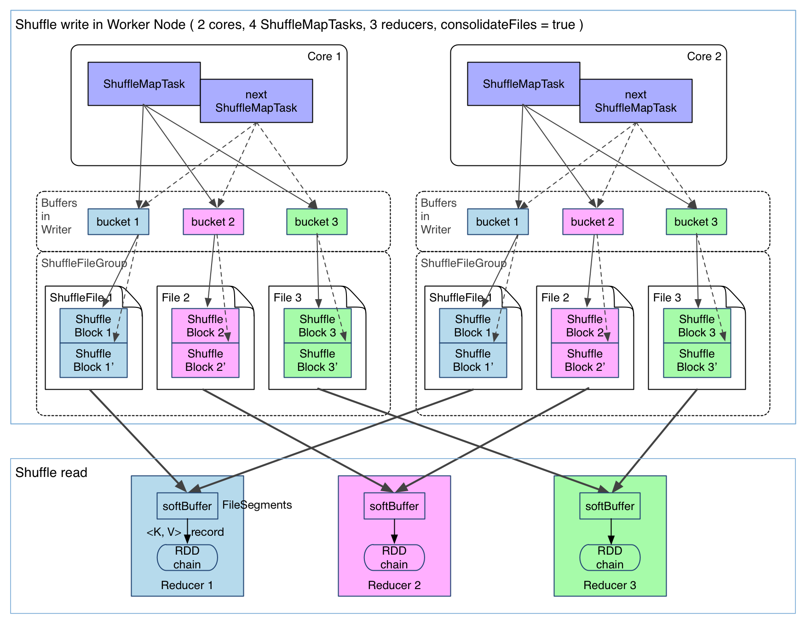
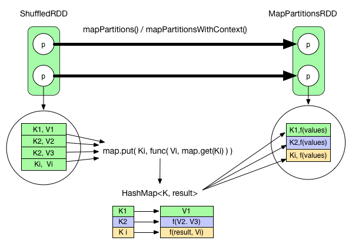
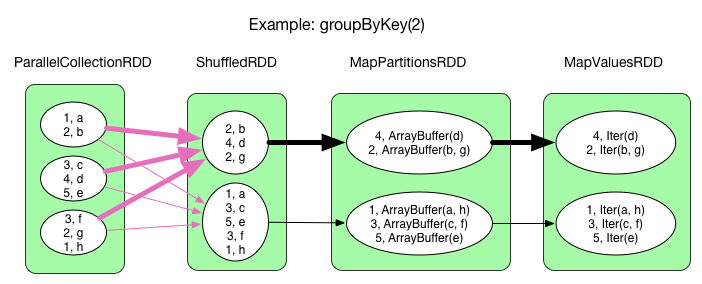
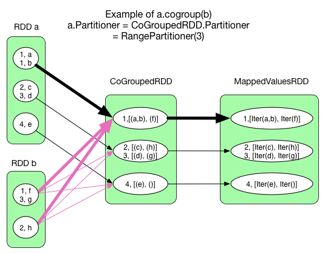
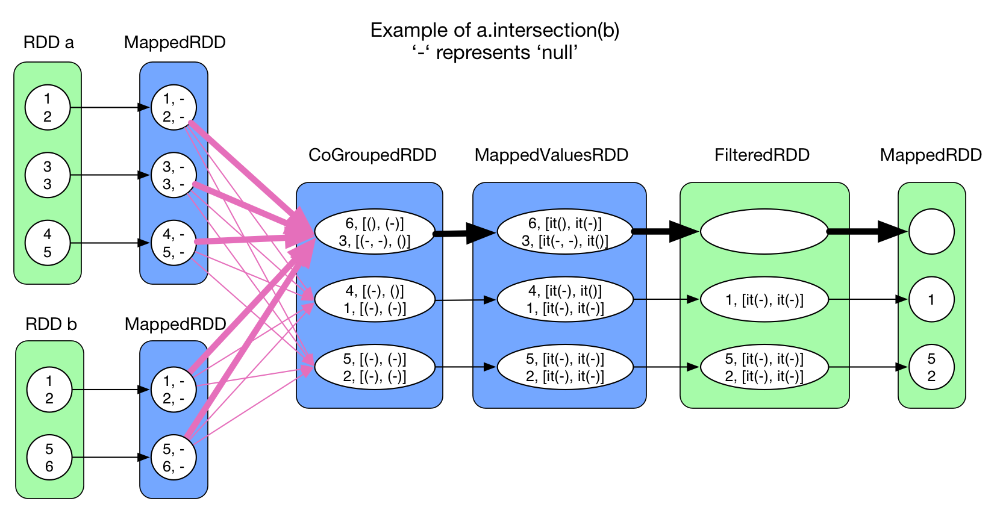
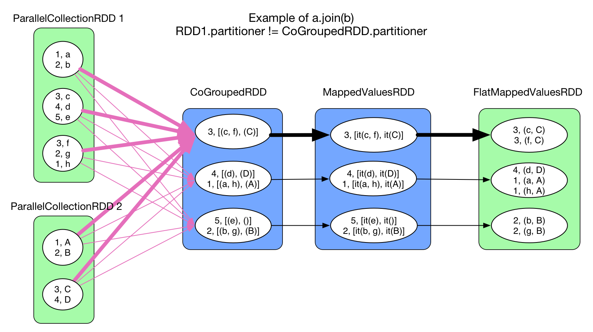
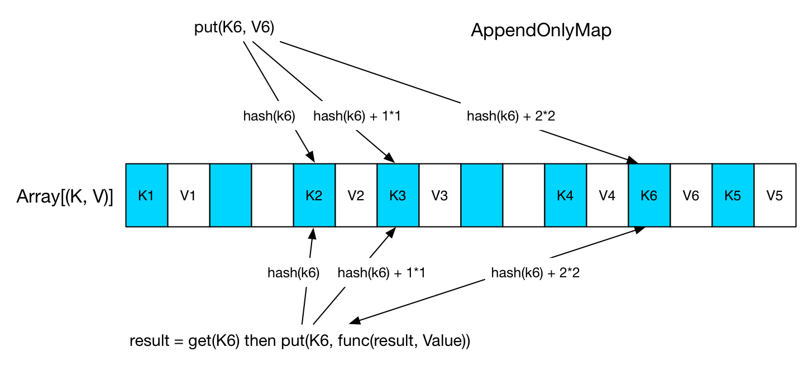
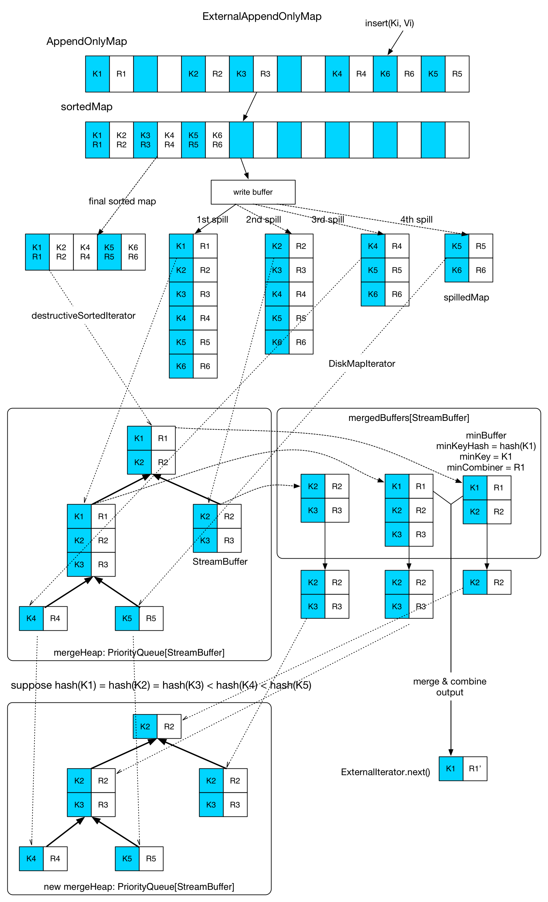

# Shuffle Process

Previously we've discussed Spark's physical plan and its execution details. But one thing is left untouched: **how data gets through a `ShuffleDependency` to the next stage?**

## Shuffle Comparison between Hadoop and Spark
There're some differences and also similarities between the shuffle process in Hadoop and in Spark:

**From a high-level point of view, they are similar.** They both partition the mapper's (or `ShuffleMapTask` in Spark) output and send each partition to its corresponding reducer (in Spark, it could be a `ShuffleMapTask` in the next stage, or a `ResultTask`). The reducer buffers the data in memory, shuffles and aggregates the data, and applies the `reduce()` logic once the data is aggregated.

**From a low-level point of view, there're quite a few differences.** The shuffle in Hadoop is sort-based since the records must be sorted before `combine()` and `reduce()`. The sort can be done by an external sort algorithm thus allowing `combine()` or `reduce()` to tackle very large datasets. Currently in Spark the default shuffle process is hash-based. Usually it uses a `HashMap` to aggregate the shuffle data and no sort is applied. If the data needs to be sorted, user has to call `sortByKey()` explicitly. In Spark 1.1, we can set the configuration `spark.shuffle.manager` to `sort` to enable sort-based shuffle. In Spark 1.2, the default shuffle process will be sort-based.

**Implementation-wise, there're also differences.** As we know, there are obvious steps in a Hadoop workflow: `map()`, `spill`, `merge`, `shuffle`, `sort` and `reduce()`. Each step has a predefined responsibility and it fits the procedural programming model well. However in Spark, there're no such fixed steps, instead we have stages and a series of transformations. So operations like `spill`, `merge` and `aggregate` need to be somehow included in the transformations.

If we name the mapper side process of partitioning and persisting data "shuffle write", and the reducer side reading and aggregating data "shuffle read". Then the problem becomes: **How to integrate shuffle write and shuffle read logic in Spark's logical or physical plan? How to implement shuffle write and shuffle read efficiently?**

## Shuffle Write

Shuffle write is a relatively simple task if a sorted output is not required. It partitions and persists the data. The persistance of data here has two advantages: reducing heap pressure and enhancing fault-tolerance.

Its implementation is simple: add the shuffle write logic at the end of `ShuffleMapStage` (in which there's a `ShuffleMapTask`). Each output record of the final RDD in this stage is partitioned and persisted, as shown in the following diagram:


In the diagram there're 4 `ShuffleMapTask`s to execute in the same worker node with 2 cores. The task result (records of the final RDD in the stage) is written on the local disk (data persistence). Each task has `R` buffers, `R` equals the number of reducers (the number if tasks in the next stage). The buffers are called buckets in Spark. By default the size of each bucket is 32KB (100KB before Spark 1.1) and is configurable by `spark.shuffle.file.buffer.kb` .

> In fact bucket is a general concept in Spark that represents the location of the partitioned output of a `ShuffleMapTask`. Here for simplicity a bucket is referred to an in-memory buffer.

`ShuffleMapTask` employs the pipelining techinque to compute the result records of the final RDD. Each record is sent to the bucket of its corresponding partition, which is determined by `partitioner.partition(record.getKey())`. The content of these buckets is written continuously to local disk files called `ShuffleBlockFile`, or `FileSegment` for short. Reducers will fetch their `FileSegment` in shuffle read phase.

An implementation like this is very simple, but has some issues:

1. **We may produce too many `FileSegment`.** Each `ShuffleMapTask` produces `R`(number of reducers) `FileSegment`, so `M` `ShuffleMapTask` will produce `M * R` files. For big datasets we could have big `M` and `R`, as a result there may be lots of intermediate data files.
2. **Buffers could take a lot of space.** On a worker node, we could have `R * M` buckets for each core available to Spark. Spark will reuse the buffer space after a `ShuffleMapTask` but there could still be `R * cores` buckets in memory. On a node with 8 cores processing a 1000-reducer job, buckets will take up 256MB (`R * cores * 32KB`).

Currently, there's no good solution to the second problem. We need to write buffers anyway and if they're too small there will be impact on IO speed. For the first problem, we have a file consolidation solution already implemented in Spark. Let's check it out:



It's clear that from the above diagram, consecutive `ShuffleMapTask`s running on the same core share a shuffle file. Each task appends its output data, `ShuffleBlock` i', after the output data of the previous task, `ShuffleBlock` i. A `ShuffleBlock` is called a `FileSegment`. In this way, reducers in the next stage can just fetch the whole file and we reduce the number of files needed in each worker node to `cores * R`. File consolidation feature can be activated by setting `spark.shuffle.consolidateFiles` to true.

## Shuffle Read
Let's check a physical plan of `reduceBykey`, which contains `ShuffleDependency`:


Intuitively, we need to fetch the data of `MapPartitionRDD` to be able to evaluate `ShuffleRDD`. Then come the problems:

- When to fetch? Fetch for each `ShuffleMapTask` or fetch only once after all `ShuffleMapTask`s are done?
- Fetch and process the records at the same time or fetch and then process?
- Where to store the fetched data?
- How do the tasks of the next stage know the location of the fetched data?

Solutions in Spark:

- **When to fetch?** Wait after all `ShuffleMapTask`s end and then fetch. We know that a stage will be executed only after its parent stages are executed, so it's intuitive that the fetch operation begins after all `ShuffleMapTask`s in the previous stage are done. The fetched `FileSegments` have to be buffered in memory, so we can't fetch too much before the buffer content is written to disk. Spark limits this buffer size by `spark.reducer.maxMbInFlight`, here we name it `softBuffer`. It has default size 48MB. A `softBuffer` usually contains multiple fetched `FileSegments`. But sometimes one single segment can fill up the buffer.

- **Fetch and process the records at the same time or fetch and then process?** Fetch and process the records at the same time. In MapReduce, the shuffle stage fetches the data and then applies `combine()` logic at the same time. However in MapReduce the reducer input data needs to be sorted, so the `reduce()` logic is applied after the shuffle-sort process. Since Spark does not require a sorted order for the reducer input data, we don't need to wait until all the data gets fetched to start processing. **Then how Spark implements this shuffle and processing?** In fact Spark utilizes data structures like HashMap to do the job. Each \<Key, Value\> pair from the shuffle process is inserted into a HashMap. If the `Key` is already present, then the pair is aggregated by `func(hashMap.get(Key), Value)`. In the above WordCount example, the `func` is `hashMap.get(Key) + Value`, and its result is updated in the HashMap. This `func` has a similar role to `reduce()` in Hadoop, but they differ in details. We illustrate the difference by the following code snippet:

	```java
	// MapReduce
	reduce(K key, Iterable<V> values) {
		result = process(key, values)
		return result
	}

	// Spark
	reduce(K key, Iterable<V> values) {
		result = null
		for (V value : values)
			result  = func(result, value)
		return result
	}
	```

In Hadoop MapReduce, we can define any data structure we like in `process` function. It's just a function that takes an `Iterable` as parameter. We can also choose to cache the `values` for further processing. In Spark, a `foldLeft` like technique is used to apply the `func`. For example, in Hadoop, it's very easy to compute the average out of `values`: `sum(values) / values.length`. But it's not the case in the Spark model. We'll come back to this part later.

- **Where to store the fetched data?** The fetched `FileSegment`s get buffered in `softBuffer`. Then the data is processed, and written to a configurable location. If `spark.shuffle.spill` is false, then the write location is only memory. A special data structure, `AppendOnlyMap`, is used to hold these processed data in memory. Otherwise, the processed data will be written to memory and disk, using `ExternalAppendOnlyMap`. This data structure can spill the sorted key-value pairs on disk when there isn't enough memory available. **A key problem in using both memory and disk is how to find a balance of the two.** In Hadoop, by default 70% of the memory is reserved for shuffle data. Once 66% of this part of the memory is used, Hadoop starts the merge-combine-spill process. In Spark a similar strategy is used. We'll talk about its details later in this chapter.

- **How do the tasks of the next stage know the location of the fetched data?** Recall that in the last chapter, there's an important step: `ShuffleMapStage`, which will register its final RDD by calling `MapOutputTrackerMaster.registerShuffle(shuffleId, rdd.partitions.size)`. So during the shuffle process, reducers get the data location by querying `MapOutputTrackerMaster` in the driver process. When a `ShuffleMapTask` finishes, it will report the location of its `FileSegment` to `MapOutputTrackerMaster`.

Now we have discussed the main ideas behind shuffle write and shuffle read as well as some implementation details. Let's dive into some interesting details.

## Shuffle Read of Typical Transformations

### `reduceByKey(func)`

We have briefly talked about the fetch and reduce process of `reduceByKey()`. Note that for an RDD, not all its data is present in the memory at a given time. The processing is always on a record basis. Processed record is rejected if possible. On a record level perspective, the `reduce()` logic can be shown as below:



We can see that the fetched records are aggregated using a HashMap, and once all the records are aggregated, we will have the result. The `func` needs to be commutative.

A `mapPartitionsWithContext` operation is used to transform the `ShuffledRDD` to a `MapPartitionsRDD`.

To reduce network trafic between nodes, we could use map side `combine()` in Hadoop. It's also feasible in Spark. All we need is to apply the `mapPartitionsWithContext` in the `ShuffleMapStage`. For example in `reduceByKey` , the transformation of `ParallelCollectionRDD` to `MapPartitionsRDD` is equivalent to a map side combine.

**Comparison between map()->reduce() in Hadoop and `reduceByKey` in Spark**
- map side: there's no difference on the map side. For `combine()` logic, Hadoop imposes a sort before `combine()`. Spark applies the `combine()` logic by using a hash map.
- reduce side: Shuffle process in Hadoop will fetch the data until a certain amount, then applies `combine()` logic, then merge sort the data to feed the `reduce()` function. In Spark fetch and reduce is done at the same time (in a hash map), so the reduce function needs to be commutative.

**Comparison in terms of memory usage**
- map side: Hadoop needs a big, circular buffer to hold and sort the `map()` output data. But `combine()` does not need extra space. Spark needs a hash map to do `combine()`. And persisting records to local disk needs buffers (buckets).
- reduce side: Hadoop needs some memory space to store shuffled data. `combine()` and `reduce()` require no extra space since their input is sorted and can be grouped and then aggregated. In Spark, a `softBuffer` is needed for fetching. A hash map is used for storing the result of `combine()` and `reduce()`, if only memory is used in processing data. However, part of the data can be stored on disk if configured to use both memory and disk.

### `groupByKey(numPartitions)`



The process is similar to that of `reduceByKey()`. The `func` becomes `result = result ++ record.value`. This means that each key's values are grouped together without further aggregation.

### `distinct(numPartitions)`


Similar to `reduceByKey()`. The `func` is `result = result == null ? record.value : result`. This means that we check the existence of the record in the `HashMap`. If it exists, reject the record, otherwise insert it into the map. Like `reduceByKey()`, there's map side `combine()`.

### `cogroup(otherRDD, numPartitions)`



There could be 0, 1 or multiple `ShuffleDependency` for a `CoGroupedRDD`. But in the shuffle process we don't create a hash map for each shuffle dependency, but one hash map for all of them. Different from `reduceByKey`, the hash map is constructed in RDD's `compute()` rather than in `mapPartitionsWithContext()`.

A task of this RDD's execution will allocate an `Array[ArrayBuffer]`. This array contains the same number of empty `ArrayBuffer`s as the number of input RDDs. So in the example we have 2 `ArrayBuffers` in each task. When a key-value pair comes from RDD A, we add it to the first `ArrayBuffer`. If a key-value pair comes from RDD B, then it goes to the second `ArrayBuffer`. Finally a `mapValues()` operation transforms the values into the correct type: `(ArrayBuffer, ArrayBuffer)` => `(Iterable[V], Iterable[W])`.

### `intersection(otherRDD)` and `join(otherRDD, numPartitions)`





This two operations both use `cogroup`, so their shuffle process is identical to `cogroup`.

### sortByKey(ascending, numPartition)


The processing logic of `sortByKey()` is a little different from `reduceByKey()` as it does not use a `HashMap` to handle incoming fetched records. Instead, all key-value pairs are range partitioned. The records of the same partition is sorted by key.

### `coalesce(numPartitions, shuffle = true)`


`coalesce()` would create a `ShuffleDependency`, but it actually does not need to aggregate the fetched records, so no hash map is needed.

## HashMap in Shuffle Read

So as we have seen, hash map is a frequently used data structure in Spark's shuffle process. Spark has 2 versions of specialized hash map: in memory `AppendOnlyMap` and memory-disk hybrid `ExternalAppendOnlyMap`. Let's look at some details of these two hash map implementations.

### `AppendOnlyMap`

The Spark documentation describes `AppendOnlyMap` as "A simple open hash table optimized for the append-only use case, where keys are never removed, but the value for each key may be changed". Its implementation is simple: allocate a big array of `Object`, as the following diagram shows. Keys are stored in the blue sections, and values are in the white sections.



When a `put(K, V)` is issued, we locate the slot in the array by `hash(K)`. **If the position is already occupied, then quadratic probing technique is used to find the next slot.**. For the example in the diagram, `K6`, a third probing has found an empty slot after `K4`, then the value is inserted after the key. When `get(K6)`, we use the same technique to find the slot, get `V6` from the next slot, compute a new value, then write it to the position of `V6`.

Iteration over the `AppendOnlyMap` is just a scan of the array.

If 70% of the allocated array is used, then it will grow twice as large. Keys will be rehashed and the positions re-organized.

There's a `destructiveSortedIterator(): Iterator[(K, V)]` method in `AppendOnlyMap`. It returns sorted key-value pairs. It's implemented like this: first compact all key-value pairs to the front of the array and make each key-value pair in a single slot. Then `Array.sort()` is called to sort the array. As its name indicates, this operation will destroy the structure.

### `ExternalAppendOnlyMap`



Compared with `AppendOnlyMap`, the implementation of `ExternalAppendOnlyMap` is more sophisticated. Its concept is similar to the `shuffle-merge-combine-sort` process in Hadoop.

`ExternalAppendOnlyMap` holds an `AppendOnlyMap`. Incoming key-value pairs are inserted into the `AppendOnlyMap`. **When `AppendOnlyMap` is about to grow its size, we'll check the available memory space. If there's still enough space, the `AppendOnlyMap` doubles its size, otherwise all its key-value pairs are sorted and then spilled onto local disk (by using `destructiveSortedIterator()`).** In the diagram, there're 4 spills of this map. In each spill, a `spillMap` file will be generated and a new, empty `AppendOnlyMap` will be instantiated to receive incoming key-value pairs. In `ExternalAppendOnlyMap`, when a key-value pair is inserted, it gets aggregated only with the in memory part (the `AppendOnlyMap`). So it means when asked for the final result, a global merge-aggregate needs to be performed on all spilled maps and the in memory `AppendOnlyMap`.

**Global merge-aggregate runs as follows.** Firstly the in memory part (`AppendOnlyMap`) is sorted to a `sortedMap`. Then `DestructiveSortedIterator` (for `sortedMap`) or `DiskMapIterator` (for on disk `spillMap`) will be used to read a part of the key-value pairs into a `StreamBuffer`. Then the `StreamBuffer` is inserted into a `mergeHeap`. In each `StreamBuffer`, all records have the same `hash(key)`. Suppose that in the example, we have `hash(K1) == hash(K2) == hash(K3) < hash(K4) < hash(K5)`. As a result, the first 3 records of the first spilled map are read into the same `StreamBuffer`. The merge is simple: get `StreamBuffer`s with the same key hash using a heap, then put them into an `ArrayBuffer[StreamBuffer]`(`mergedBuffers`) for merge. The first inserted `StreamBuffer` is called `minBuffer`, the key of its first key-value pair is `minKey`. One merge operation will aggregate all KV pairs with `minKey` in the `mergedBuffer` and then output the result. When a merge operation in `mergedBuffer` is over, remaining KV pairs will return to the `mergeHeap`, and empty `StreamBuffer` will be replaced by a new read from in-memory map or on-disk spill.

There're still 3 points needed to be discussed:
  - Available memory check. Hadoop allocates 70% of the memory space of a reducer for shuffle-sort. Similarly, Spark has `spark.shuffle.memoryFraction * spark.shuffle.safetyFraction` (defaults to 0.3 * 0.8) for `ExternalAppendOnlyMap`. **It seems that Spark is more conservative. Moreover, this 24% of memory space is shared by all reducers in the same executor.** An executor holds a `ShuffleMemoryMap: HashMap[threadId, occupiedMemory]` to monitor memory usage of all `ExternalAppendOnlyMap`s in each reducer. Before an `AppendOnlyMap` grows, the total memory usage after the growth will be computed using the information in `ShuffleMemoryrMap`, to see if there's enough space. Also notice that the first 1000 records will not trigger the spill check.

  - `AppendOnlyMap` size estimation. To know the size of an `AppendOnlyMap`, we can compute the size of every object referenced in the structure during each growth. But this takes too much time. Spark has an estimation algorithm with O(1) complexity. Its core concept is to see how the map size changes after the insertion and aggregation of a certain amount of records to estimate the structure size. Details are in `SizeTrackingAppendOnlyMap` and `SizeEstimator`.

  - Spill process. Like the shuffle write, Spark creates a buffer when spilling records to disk. Its size is `spark.shuffle.file.buffer.kb`, defaulting to 32KB. Since the serializer also allocates buffers to do its job, there'll be problems when we try to spill lots of records at the same time. Spark limits the records number that can be spilled at the same time to `spark.shuffle.spill.batchSize`, with a default value of 10000.

## Discussion
As we've seen in this chapter, Spark is way more flexible in the shuffle process compared to Hadoop's fixed shuffle-combine-merge-reduce model. It's possible in Spark to combine different shuffle strategies with different data structures to design an appropriate shuffle process based on the semantic of the actual transformation.

So far we've discussed the shuffle process in Spark without sorting as well as how this process gets integrated into the actual execution of the RDD chain. We've also talked about memory and disk issues and compared some details with Hadoop. In the next chapter we'll try to describe job execution from an inter-process communication perspective. The shuffle data location problem will also be mentioned.

Plus to this chapter, thers's the outstanding blog (in Chinese) by Jerry Shao, [Deep Dive into Spark's shuffle implementation](http://jerryshao.me/2014/01/04/spark-shuffle-detail-investigation/).
